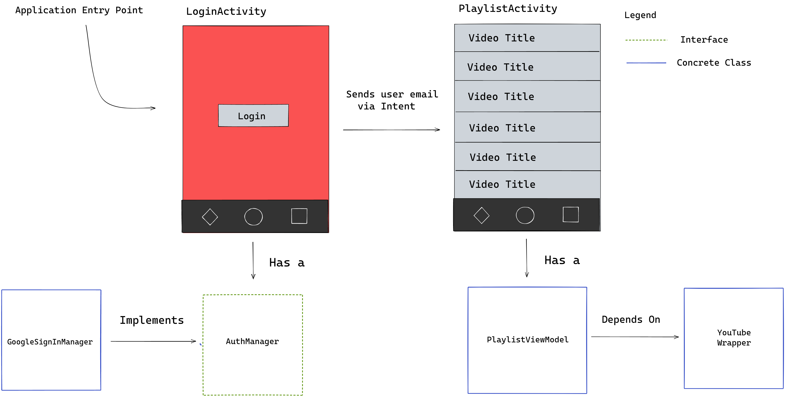

*Disclaimer: I'm not an experienced Dagger developer, I've made this post to gather my thoughts because I had a moment of clarity. In case I ever forget what I learned, I can come back here and relearn it.*

*Why make it public? From the perspective of a beginner, I think I have a good example that might help experienced developers explain dagger to other people like me.*
 

### Pre-Requisites

- This post assumes you already understand Dagger Components and how to do Bindings to the Dagger object graph (i.e. using `@Inject`, `@Provides` and `@Binds`).
- It also assumes that you know how a basic Android Application works

## The subcomponent hill

After learning how to provide dependencies using a single `@Component` that encompasses the whole application lifetime, it's tempting to use `@Singleton` and `Provider<T>` to resolve all of your dependencies, since it makes so simple to `@Inject` everything you need. 


## The application

The application we'll build will query the [Youtube Data API](https://developers.google.com/youtube/v3) for the favorites videos of a user after making a simple authentication using the [Google SignIn library](https://developers.google.com/identity/sign-in/android), but previous knowledge of these libraries is not required. 

It'll have two activities, one for login and another with the list of favorite videos' titles, with a `ViewModel` for the latter. The login activity will need a `AuthManager` interface that manages the sign in with Google and the `PlaylistViewModel` for the list will use a `YouTube` wrapper class provided by the [Youtube API client](https://developers.google.com/api-client-library/java/).

Here is a visualization of this structure:



This is a very basic application but due to the way the Youtube API Client wrapper is designed, it presents a perfect opportunity to show how `@Subcomponent` work.

## Project Setup

There is a small annoying setup on the [google developers console](https://console.developers.google.com/) necessary to use those libraries. I'll give the steps if you wish to follow along, but you can still understand the article without doing it. If you don't want to follow along, you can jump to the [next section](#the-login-screen).

For the sake of brevity, I've made a github repository with the screens and libraries already setup. The setup necessary is only for accessing the Google APIs.  

1. Setup your google developers console to activate the Youtube Data API

	- Open the [console](https://console.developers.google.com/)
	- Go to the *Library tab* on the side navigation panel
	- Search for *Youtube Data*, click on the option that appears.
	- Click the *Enable* button
	- Go to the *credentials tab* on the side navigation panel
	- Click on *Create Credentials*, choose the Android *Application Type* and fill the fields
	- on the SHA-1 field you need to run the following command on the terminal

```bash{promptUser: edujtm}
keytool -list -v -keystore ~/.android/debug.keystore -alias androiddebugkey -storepass android -keypass android
```


<br />

## The Login screen

With everything setup, we can begin implementing the login screen which will need an `AuthManager` to manage the user authentication. The login button sends an intent.

```Kotlin

class LoginActivity : AppCompatActivity() {
	lateinit var authManager: AuthManager

	override fun onCreate(savedInstanceState: Bundle?) {
		super.onCreate(savedInstanceState)
		setContentView(R.layout.activity_login)

		login_btn.setOnClickListener {
			// The Sign-In library uses an intent for authentication
			val intent = authManager.getSignInIntent()
			startActivityForResult(intent, REQUEST_SIGN_IN)
		}
	}

	override fun onActivityResult() {

	}

	companion object {
		const val REQUEST_SIGN_IN = 1000
	}
}
```

<br />

We need to get an `AuthManager` instance, since a `@Component` is our window to the Dagger object graph (which we'll still build), we need to start there. So let's create a `AppComponent` that will start our dependency graph.

```Kotlin

@Component
interface AppComponent {
	val authManager: AuthManager	
}
```
