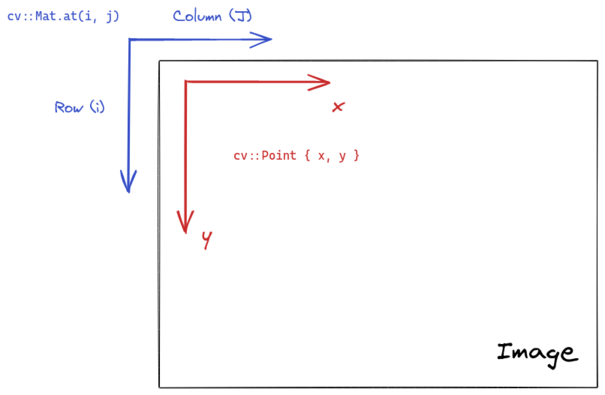
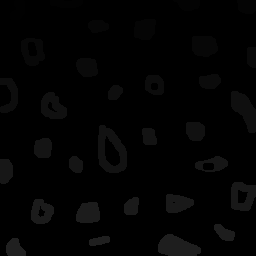
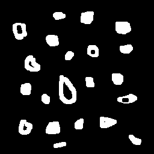
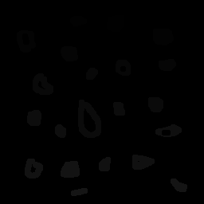
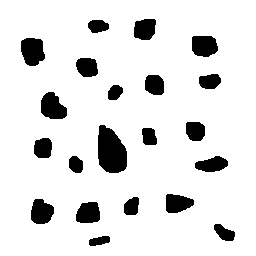
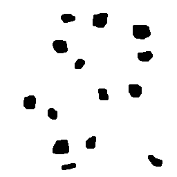

Due to the varying amount of patterns in an image, its not simple to select complex regions of interest in order to do operations on them. We need to have a way to make this region stand out from the rest of the picture, but we need to deal with noise, complex shapes and other objects that might be in the way of what we're trying to do.

One way to to tackle this problem is to try and generate a binary image that highlights regions of the image that we might be interested in. Since binary images only have two possible values, we can use all the others for tagging regions for post-processing and act accordingly depending on each tag. Assuming that those regions are separated by the background, we can use [cv::floodFill](https://docs.opencv.org/4.4.0/d7/d1b/group__imgproc__misc.html#gaf1f55a048f8a45bc3383586e80b1f0d0) to label the different regions.

The `cv::floodFill()` function works in the same way as the bucket functionality that's present in a lot of image manipulation programs available. It fills every neighbouring pixel with similar intensities to the starting point with a given new intensity. This is the API available in OpenCV for the flood fill algorithm:

```Cpp
int cv::floodFill(
	cv::InputOutputArray image,       // The image for which a region will be filled with newVal
	cv::Point seedPoint,              // The place point we want to start filling
	cv::Scalar newVal,                // The new intensity/color
	cv::Rect *rect = 0,               // An output rectangle that bounds the painted region
	cv::Scalar lowDiff = Scalar()     // The lower bound is given by neighbour intensity minus lowDiff
	cv::Scalar highDiff = Scalar()    // The upper bound is given by neighbour intensity plus highDiff 
	int flags                         // A set of flags that change the algorithm (e.g. type of connectivity)
)
```
<i>There's another definition that accepts a mask to select the regions which can be filled, but works in the same way. The mask also will have the painted image regions as non-zero values after the operation.</i>

Let's see an example about how we might use it for selecting regions.

## A labeling problem

Let's say that after processing an image, we got the following binary image with white bubbles inside.


Suppose we're tasked with counting the number of bubbles inside the image, using some algorithm of our choice. How can we go about solving this task? It's easy to count the bubbles by eye, but it's not simple to give the same information to the computer. If we try counting white pixels, we need to make sure that we don't count the same region more than once. In order to avoid this, we need to remove all other pixels that belong to a region when we find the first pixel of that region, that's where flood fill comes in.

This idea might be implemented like this:

```Cpp
int objects_qnt = 0;
cv::Mat image = /* binary image */

for (int i = 0; i < image.rows; i++) {
	// Optimization that avoids recalculating row offset on every pixel
	uchar* row_ptr = image.ptr<int>(i);  

	for (int j = 0; j < image.cols; j++, row_ptr++) {
		if (*row_ptr == 255) {
			cv::Point loc { j, i };
			objects_qnt++;
			// We label the region with 
			cv::floodFill(image, loc, objects_qnt);
		}
	}
}
```
<br/>

One thing that is important to note is the change in axis between the image (i, j) coordinates and the `cv::Point { j, i }` instantiation. The matrix notation has (row, column) indexing while the point have an x for horizontal and y for vertical representation. This change is illustrated below:



The implementation above would count all the bubbles in the picture and leave them marked for post-processing. The problem here is that we can't count more than the maximum limit given by the **unsigned char** type. As soon as we get to 255 objects, the region would be repainted in white and counted multiple times.

We need to convert the image to another type, but `cv::floodFill()` only works with **8-bit integer** and **floating point** images. Given these options, we can choose the **float** type which will give us a big counting limit. OpenCV gives us [Mat::convertTo()](https://docs.opencv.org/4.4.0/d3/d63/classcv_1_1Mat.html#adf88c60c5b4980e05bb556080916978b) that changes the underlying type, but does not rescale intensities to the new range. With these constraints, we arrive at this solution:

```Cpp
/*
 * The template here is used so that we can do the rescaling for multiple data types.
 */
template<typename DataType>
cv::Mat rescale_intensities(cv::Mat input, DataType new_min, DataType new_max) {
    static_assert(std::is_arithmetic<DataType>::value, "data type for rescaling intensities must be numeric");

    cv::Mat temp = input.clone();
    double input_min, input_max;
    cv::minMaxLoc(temp, &input_min, &input_max);

    cv::Mat result = (new_max - new_min) * (temp - input_min) / (input_max - input_min) + new_min;
    return result;
}

int main() {
    /* image pre-processing code */

    // The way we count the objects is dependent on the
    // data representation type.
    // The maximum number of objects we can count is defined
    // by the maximum amount the type can hold.
    cv::Mat float_image = /* some binary image */;
    image.convertTo(float_image, CV_32FC1);

    // convertTo only changes the type, we still need to change the 
    // image intensities
    cv::Mat rescaled_image = rescale_intensities(int_image, (float) 0., std::numeric_limits<float>::max());

    /* image post-processing code */
}
```
<br/>

This maps the old intensity range to the whole range of positive values that float can represent. The mapping is given by the following function: 

$$
  f(x, a, b)  = \frac{(b - a) (x - x_{min})}{x_{max} - x_{min}} + a
$$

Which maps a value $x$ with minimum value $x_{min}$ and maximum value $x_{max}$ into a new range between $a$ and $b$. We can observe that in case $x$ is equal to $x_{min}$, the result will be equal to $a$ and in case $x$ is equal to $x_{max}$, then the result will be equal to the new maximum value $b$. By mapping to a new range, we avoid any problems that would occur when the counter reached 255, which is the value used for white in the old range. 

With this, we reach the final solution to the bubble counting problem:

```Cpp
int main() {
    // The way we count the objects is dependent on the
    // data representation type.
    // The maximum number of objects we can count is defined
    // by the maximum amount the type can hold.
    cv::Mat float_image = /* some binary image */;
    image.convertTo(float_image, CV_32FC1);

    // convertTo only changes the type, we still need to change the 
    // image intensities
    cv::Mat rescaled_image = rescale_intensities(int_image, (float) 0., std::numeric_limits<float>::max());

    float object_qnt = 0.0;
    for (int i = 0; i < image.rows; i++) {
      // Optimization that avoids recalculating row offset on every pixel
      float* row_ptr = rescaled_image.ptr<float>(i);  

      for (int j = 0; j < image.cols; j++, row_ptr++) {
        if (std::abs(*row_ptr - std::numeric_limits<float>::max()) < 0.001) {
          cv::Point loc { j, i };
          object_qnt++;
          // We label the region with the quantity of objects
          cv::floodFill(image, loc, objects_qnt);
        }
      }
    }

    std::cout << "The figure has " << object_qnt << " bubbles." << std::endl;
}
```
  <br/>

Notice that we're now using an approximation equality comparison due to floating point rouding errors. Running the binary gives us the answer.

```bash{promptUser: edujtm}{outputLines: 2}
./build/labeling ../bubbles.png
The figure has 32 bubbles.
```
<br/>

If we convert the image to **unsigned char** and show it with `cv::imshow()`, we get the following result:



We can see the faint change in intensity between the labelled regions and the dark background. Showing the image in this way only works because there's less than 255 bubbles in it. If the image had more, we could rescale the intensities to the range [0.0, 1.0], but there wouldn't be much visual information. The value of the labelled image comes from using it in other processing steps, which we're going to see next.

## Counting holes: using flood fill in a pipeline

We're happy with our bubble counter but a new task has been given to us: we need to count the number of holes inside bubbles, since they might represent manufacturing failures. We're allowed to make two assumptions:

- We don't need to count bubbles that touch the border of the image
- Objects with more than one hole might exist

From the bubble counter we developed, we already know how to count and label the bubbles, but now we need to somehow detect the holes inside them. We know that four invariants are going to happen after the labeling process: 

1. The background is going to have intensity equal to 0 
2. the bubbles are going to have intensities different than 0 
3. the holes are also going to have intensities equal to 0
4. holes are surrounded by pixels from bubbles, otherwise it would be part of the background

From the second and fourth points, we can derive an algorithm that finds holes: If we find a pixel with intensity equal to 0, we check the pixel to the left of it and if its intensity is different than 0, it means that we've found a hole. We don't want to do this check for every pixel in the background, so we can paint the background with the maximum value possible, that way only the holes will have intensity 0. We would have to take care of not reading pixels out of bounds, but since we're not required to count bubbles on the border, we can just remove them, that way all pixels of the border are going to become part of the background and painted white.

Let's see how to implement this in a step by step way.

### Removing pixels from the border

Removing bubbles from the border is not too complex: if we find any white pixel on the border, we paint it black using flood fill. This can be implemented as follows:

```Cpp
/* Template alias for readability (std::numeric_limits is kinda of a long name) */
template<typename T>
using limits = std::numeric_limits<T>

void remove_bubbles_at_border(cv::Mat_<float> input) {
    for (int i = 0; i < input.cols; i++) {
        // Removes bubbles touching top border
        if (std::abs(input.at<float>(0, i) - limits<float>::max()) < 0.001) {
            cv::Point location { i, 0 };
            cv::floodFill(input, location, 0.0);
        }

        // Removes bubbles touching the bottom border
        if (std::abs(input.at<float>(input.rows - 1, i) - limits<float>::max()) < 0.001) {
            cv::Point location { i, input.rows - 1 };
            cv::floodFill(input, location, 0.0);
        }
    }

    for (int i = 0; i < input.rows; i++) {
        // Removes bubbles touching the left border
        if (std::abs(input.at<float>(i, 0) - limits<float>::max()) < 0.001) {
            cv::Point location { 0, i };
            cv::floodFill(input, location, 0.0);
        }

        // Removes bubbles touching the right border
        if (std::abs(input.at<float>(i, input.cols - 1) - limits<float>::max()) < 0.001) {
            cv::Point location { input.cols-1, i };
            cv::floodFill(input, location, 0.0);
        }
    }

}
```
<br/>

After applying this function to the image, this is the result we get:



### Counting and labeling bubbles

Next we need to count and label bubbles. We have already done this at the first part of this article, so we're just going to move the implementation into a function.

```Cpp
float count_and_label_bubbles(cv::Mat_<float> input) {
    int width = input.cols;
    int height = input.rows;

    cv::Point p { 0, 0 };
    float object_qnt = 0;
    try {
        for (int i = 0; i < height; i++) {
            float* row_ptr = input.ptr<float>(i);
            for (int j = 0; j < width; j++, row_ptr++) {
                if (std::abs(*row_ptr - limits<float>::max()) < 0.001) {
                    object_qnt++;
                    p.x = j;
                    p.y = i;
                    cv::floodFill(input, p, object_qnt);
                }
            }
        }
    } catch (const cv::Exception& e) {
        std::cout << "Exception occurred: " << e.what() << std::endl;
        exit(1);
    }

    return nobjects;
}
```
<br/>

With the result after this step being similar to what we've got in the first part as well:



The image seems totally dark, but there are very faint bubbles in it.

### Painting the background as white

Since we know that there are no bubbles at the borders, it follows that all pixels at the borders line are part of the background. If we do a flood fill in any of them, the background will turn white. We can choose the top left corner.

```Cpp
void fill_background(cv::Mat_<float> input, float value) {
    cv::Point top_right { 0, 0 };
    cv::floodFill(input, top_right, value);
}
```

After this step, we'll have an image like this:



### Counting holes

Now we have everything ready to count the holes. The only pixels that are still equal to 0 are the ones that belong to holes so we can do the same process we used when counting bubbles: if we find a pixel equal to 0, raise the counter and then use flood fill to remove the region. We're also going to remove the bubble as well, so we can see which bubbles were removed.

```Cpp
float count_holes(cv::Mat_<float> input) {
    float nholes = 0;
    for (int i = 0; i < input.rows; i++) {
        float* row_ptr = input.ptr<float>(i);
        for (int j = 0; j < input.cols; j++, row_ptr++) {
            if (std::abs(*row_ptr - 0.0) < 0.001) {
                cv::Point location { j, i };
                // We don't need to worry about edges
                // since we removed all bubbles there
                cv::Point previous { j-1, i };

                cv::floodFill(input, location, limits<float>::max());
                cv::floodFill(input, previous, limits<float>::max());
                nholes++;
            }
        }
    }

    return nholes;
}
```
<br/>

After running this step of the pipeline, we can see that the bubbles with holes were removed.



### The full pipeline

The final step is just to run the functions in order.

```Cpp
int main(int argc, char* argv[]) {
    auto config = parse_cli(argc, argv);

    cv::Mat image = cv::imread(config.input_path, cv::IMREAD_GRAYSCALE);
    if (!image.data) {
        std::cout << "Couldn't load specified image" << std::endl;
        exit(1);
    }

    cv::Mat cloned_image = image.clone();
    
    // do the type and intensity conversions
    cloned_image.convertTo(cloned_image, CV_32FC1);
    cloned_image = rescale_intensities(cloned_image, (float) 0., limits<float>::max());

    // Start pipeline (all operations assume 32 bit floating point values)
    remove_bubbles_at_border(cloned_image);
    float nobjects = count_and_label_bubbles(cloned_image); 
    fill_background(cloned_image, limits<float>::max());
    float nholes = count_holes(cloned_image);

    cv::Mat visible_image = rescale_intensities(cloned_image, limits<uchar>::min(), limits<uchar>::max());
    std::cout << "The figure has " << nobjects << " bubbles" << std::endl;
    std::cout << "The figure has " << nholes << " holes." << std::endl;
    cv::imshow("initial_image", image);
    cv::imshow("result", visible_image);
    cv::waitKey();

    return 0;
}
```
<br/>

Which gives us the expected result:

```bash{promptUser: edujtm}{outputLines: 2-3}
./build/count_holes ../bubbles.png
The figure has 21 bubbles.
The figure has 7 holes.
```
<br/>

## Conclusion 

Hopefully this example makes clear that we can use flood fill to tag regions of similar intensity for further processing. We can combine pre-processing steps, such as applying a canny filter, to try to separate regions and then use flood fill to tag it for further processing. One example where this could be useful is making a green screen effect, where we would tag all the green pixels with a constant number and then replace these pixels with a custom background. In summary, the flood fill function can be used for more than just painting sections of an image when used in a processing pipeline.
