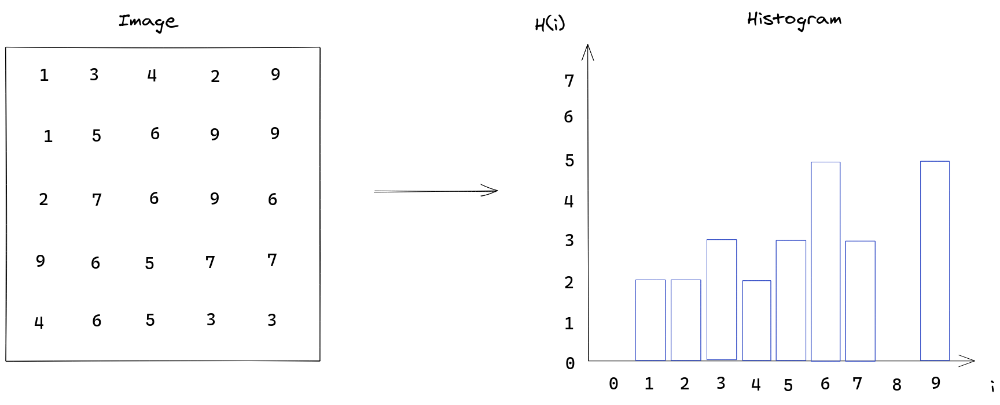
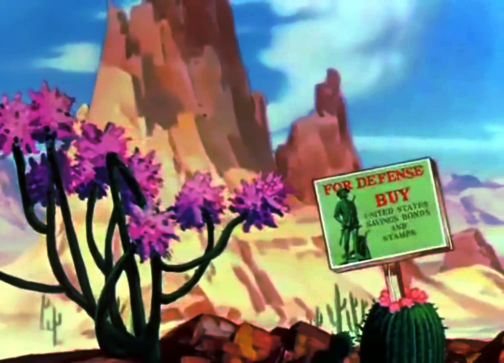
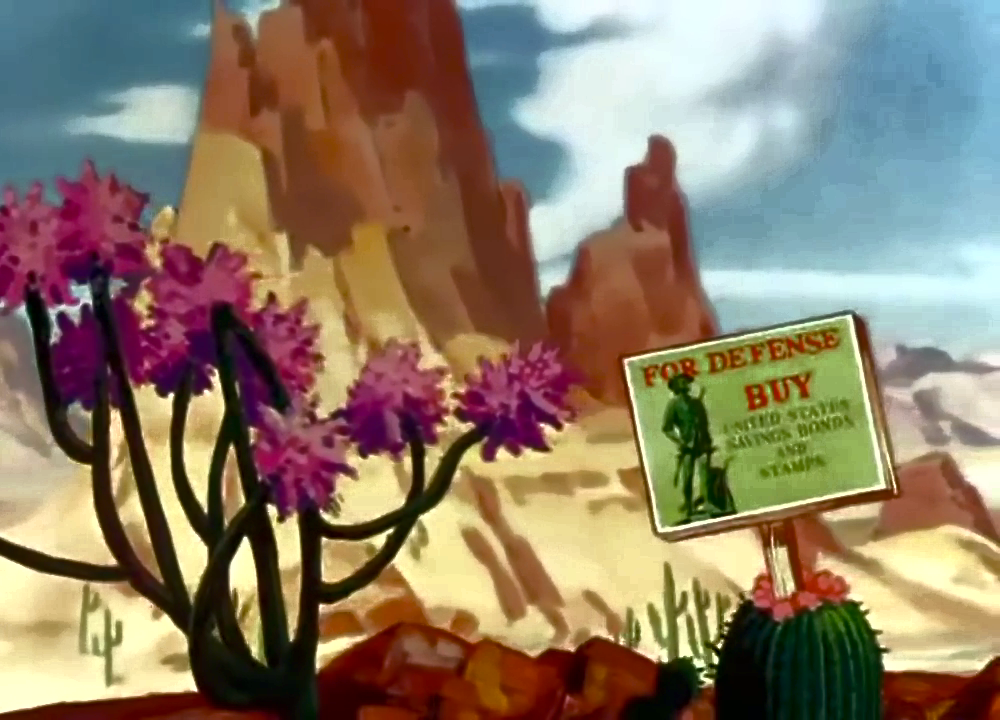
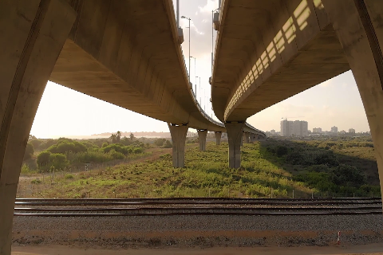
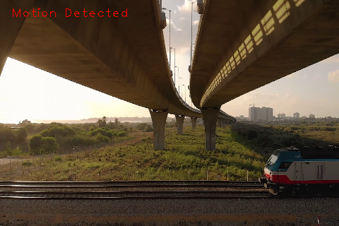

Suppose your boss tells you to implement a motion detector for his company, but you've never done this before and he gave you a really short deadline. 
At first sight it seems that detecting motion in a picture might be a challenging task: how do we define what is a movement from a group of pixels 
if there's no defined relationship between them? If we go with the route of processing individual pixels to check if they've changed their position, that for sure will lead to some headaches.

You then go check the internet for solutions and you find that current image procesing techniques allows for various methods of detecting motion in a video stream using segmentation techniques to
separate foreground objects from the background. These techniques often employ complex mathematical tricks that might go over the 
head of the uninitiated, so we would like to find a simpler implementation that's not as robust but still does the job.

Luckily there's a simpler form of doing it, that requires thinking about properties of the image in its entirety rather than its components. If we assume that any moving object will introduce new pixels into the image, either from the background behind the object or from the object itself, we can use the change in the quantity of pixel intensities over the whole image to determine if there's movement. A representation of the frequency of data in a sample is given by an histogram. Since working with histogram is very useful in computer vision, OpenCV offers a set of tools for creating and manipulating this kind of data representation.

## Understanding histograms in OpenCV

Before we implement our motion detector, we first need to understand what is a histogram and how to work with them in OpenCV. When it comes to images, the histogram is a representation of the frequencies of intensities from all the pixels. This is done by separating the full value range of intensities into partitions and counting every pixel whose intensity falls within each partition. In the simplest case where the number of partitions (bins) is the same as the quantity of values in the range, we get an image histogram like this:



But the number of bins doesn't need to be the same as the size of the intensity range and the size of each partition might not be uniform. In the previous image we could group the values in 5 bins instead of 10, which would give the ranges: \[0, 2\), \[2, 4\), \[4, 6\),  \[6, 8\), \[8, 10\).

The function OpenCV gives to get the histogram from an image is [cv::calcHist()](https://docs.opencv.org/4.4.0/d6/dc7/group__imgproc__hist.html#ga4b2b5fd75503ff9e6844cc4dcdaed35d) and it has a fairly complicated API due to it being a generic function that tries to adapt itself to one or multiple images of varying channels with uniform or non-uniform intensity bins. We will only use it for a single image, so we need to adapt this image to what is expected by the API (i.e. a vector of images).

```Cpp
cv::calcHist(
	const cv::Mat* images,      // C-Style array of images
	int nimages,                // Number of images in images array
	const int* nchannels,       // The number of channels in each image
	InputArray mask,            // Which pixels are taken into consideration
	OutputArray hist,           // The output histogram for all images
	int dims,                   // Then number of dimensions of the histogram
	const int* histSize,        // The quantity of bins for each histogram
	const float** ranges,       // Defines the size of each bin
	bool uniform = true,        // Are the bins uniform? (same size)
	bool accumulate = false     // if true, the histogram will not be cleared when allocated
)
```
<br/>

Theres a lot to digest here, so let's go through the parameters one by one:

- **image** - The array with the images whose histogram is going to be calculated. The images must be 8-bit integer or 32-bit floating point. All images must have the same dimensions, but varying the number of channels is allowed.

- **nimages** - Number of images in the **image** array. Since C-style arrays don't carry information about its size, it's necessary to pass it through the API.

- **nchannels** - The channels of interest in each image. The channels are numbered as if they were flattened into a single array of all image's channels, therefore if we're interested in the 1st and 2nd channel of the first image and the 2nd channel of the second image, we would need an vector **nchannels** = { 0, 1, 4 }. A nullptr can be passed if a single image with a single channel is going to be processed.

- **mask** - A 8-bit mask that selects which pixels are going to be taken in consideration. Only pixels from the image whose corresponding pixel in the mask is non-zero will be counted. If we wish to count all pixels in the image, `cv::noArray()` can be passed.

- **hist** - The output histograms for all images.

- **dims** - The number of dimensions of the histogram. The function is able to deal with high-dimensional data in case we want to group it in high dimensional bins. For example, we might have an RGB image for which we want to see the frequency of values with a certain red and blue color, this would give us a 2 dimensional histogram where `hist.at<float>(i,j)` would give us the frequency of pixels with **red intensity = i** and **blue intensity = j**.

- **histSize** - Defines the quantity of bins used in each dimension of the histogram.

- **ranges** - The range of values of the histogram. This parameter is used to determine the range of data values that will fall within each bin. The interpretation of this value depends on the value of the **uniform** parameter: If the histogram is uniform, it's only necessary to define the minimum and maximum value of the range, which will be divided uniformly by the quantity of bins. If the histogram is not uniform, then it's necessary to define the ranges for all bins explicitly (i.e. it's necessary to specify an array with histSize[i] + 1 elements).

- **uniform** - If the histogram is uniform, then all bins are of the same size.

- **accumulate** - If the values already in **hist** are replaced or not during the operation. Setting accumulate to true allows to gather a histogram across different calls to `cv::calcHist()` given that the same variable is used for **hist**.

Since the **ranges** parameter is fairly complex, it deserves a little bit more of an explanation. Let's see how we might specify ranges for the histogram example shown in a previous image which has a intensity range between [0,10).

If we want our range to be uniform but with bin sizes of 2 elements, we can specify it as follows:

```Cpp
int *histSize = { 5 };
float *ranges[] = {
	{0, 10}
};
int dims = 1;
bool uniform = true;
```
<br/>

This would take the range from [0,10) and divide it uniformly into 5 bins.

Let's say we want to separate the range into 4 non-uniform bins of ranges [0, 2), [2,5), [5, 8) and [8, 10). The parameters would have to be specified in this way instead:

```Cpp
int *histSize = { 4 };
float *ranges[] = {
	{0, 2, 5, 8, 10}
};
int dims = 1;
bool uniform = false;
```
<br/>

Where we notice that the range for bin *i* is given by the values of *ranges[i]* and *ranges[i+1]* and we need to specify histSize[i] + 1 elements to define the range.

If we have an image encoded in HSV color space where each channel has a different range. We would need to specify a separate array for each channel:

```Cpp
int *histSize = { 60, 20, 20 };
float *ranges[] = {
	{ 0, 360 },   // range of data for hue channel
	{ 0, 100 },   // range of data for saturation channel
	{ 0, 100 },   // range of data for value channel
};
int dims = 3;
bool uniform = true;
```
<br/>

These parameters would result in a 3 dimensional histogram with the hue channel divided into 60 bins and the saturation and value are divided into 20 bins.

It's important to understand that the **images** array is not meant to generate histogram for multiple images at once, it's only a channel selection mechanism: we can pass two single-channel grayscale images and select both of the channels using **nchannels**, but this won't generate two separate histograms, instead it'll generate a single 2-dimensional histogram where each bin is an element of the cartesian product of the first and second image bins.

## Using histograms in image processing: histogram equalization  

Now that we've got an understanding of creating histograms in OpenCV, let's see how to use them in practice. One of the most simple effect we can achieve using histogram is improving image contrast with histogram equalization. This technique aims to remap pixel intensities in an image in such a way that the resulting histogram has a uniform distribution across the whole intensity range. This process is illustrated below:


If the histogram was continuous, the resulting equalization would lead to a perfectly uniform distribution, but since the histograms obtained from images are discrete, the equalization results in an approximation of the uniform distribution.

The discrete histogram equalization is defined by the following equation:

$$
  out_{k} = \frac{L-1}{MN}\sum_{j=0}^{k}hist[j] 
$$

$$
  k = 0, 1, 2, 3, ... L - 1
$$

Where a pixel with intensity $k$ in the source image would be mapped to an intensity $out_{k}$, $M$ and $N$ are the image dimensions and $L$ is the maximum intensity value. Since the output might be a fractional value, the intensities are rounded to the nearest integer.

By spreading pixel intensities across the whole intensity range, pixels are mapped in a way that the contrast between features in an image is enhanced. This could be used to recover details in a washed out image, for example.

This operation is implemented by the [cv::equalizeHist()](https://docs.opencv.org/4.4.0/d6/dc7/group__imgproc__hist.html#ga7e54091f0c937d49bf84152a16f76d6e) function in OpenCV. Let's see how we can use it to process a video stream.

### Obtaining the video stream

A video stream can be obtained using [cv::VideoCapture](https://docs.opencv.org/4.4.0/d8/dfe/classcv_1_1VideoCapture.html) class, it works for both recorded videos by specifying the path on the filesystem where it's stored and live camera feed by specifying the camera ID.


```Cpp
struct Config {
    const std::string file_path;
    const unsigned int screen_width;
    const unsigned int screen_height;
}

Config parse_cli(int argc, char* argv[]) {/* parse cli arguments */}

int main(int argc, char* argv[]) {
    auto config = parse_cli(argc, argv);
    cv::VideoCapture cap;
    if (config.file_path.empty()) {
        cap.open(0);
    } else {
        cap.open(config.file_path);
    }

    if (!cap.isOpened()) {
        std::cout << "Couldn't open camera" << std::endl;
        return -1;
    }

    // Defines the size of the frame to be captured
    cap.set(cv::CAP_PROP_FRAME_WIDTH, config.screen_width);
    cap.set(cv::CAP_PROP_FRAME_HEIGHT, config.screen_height);

    // The requested width x height might not be available
    int width = cap.get(cv::CAP_PROP_FRAME_WIDTH);
    int height = cap.get(cv::CAP_PROP_FRAME_HEIGHT);
}
```
<br/>

We need to specify the width and height of the video stream, but not all sizes are supported, so we also need to query the property to see the actual selected values.

### Reading frames

Now we need to read the frames from the video stream and apply the histogram equalization on each one.

```Cpp
int main() {
    /* obtain the video stream */

    cv::Mat image;
    while (1) {
        cap >> image;
        if (image.empty()) {
            std::cerr << "Could not read frame from video, possibly due to wrong screen dimensions." << std::endl;
            exit(1);
        }

        // --- histogram equalization ---
        auto equalizedImage = equalize_rgb(image); 
        auto equalizedLabImage = equalize_cie_lab(image);

        cv::imshow("image", image);
        cv::imshow("equalized rgb", equalizedImage);
        cv::imshow("equalized cie lab", equalizedLabImage);
        int key = cv::waitKey(30);
        if (key == ESCAPE_KEY)
            break;
    }
}
```
<br/>

Two different equalizations are being applied here, one directly in the RGB channels of the image and another that first changes the image from RGB to CIE Lab color space and then apply the equalization on the luminosity channel only.

It's only necessary to do one equalization, we're doing two different equalizations here so that we can compare the effect of each one on the original image.

### Defining the equalization

Equalizing the histogram of an RGB channel is done by equalizing each channel individually, this can generate unwanted visual artifacts in the image: Since the color information in the RGB image is only complete when the channels are combined, equalizing the channels separately might introduce new colors in the image due to the different remapping that happens on each channel. A correct equalization would have to remap the three channels identically.

Since what we want is to raise the constrast of the image intensity rather than messing with its colors, we can change the representation to one where the intensity is expressed separately.

```Cpp
/*
 * Equalization done on individual RGB channels
 */
cv::Mat equalize_rgb(cv::Mat image) {
    std::vector<cv::Mat> planes;
    cv::split(image, planes);

    std::vector<cv::Mat> equalizedChannels(3, cv::Mat());
    cv::equalizeHist(planes[0], equalizedChannels[0]); 
    cv::equalizeHist(planes[1], equalizedChannels[1]); 
    cv::equalizeHist(planes[2], equalizedChannels[2]); 

    cv::Mat equalizedImage;
    cv::merge(equalizedChannels, equalizedImage);
    return equalizedImage;
}

cv::Mat equalize_cie_lab(cv::Mat image) {
    std::vector<cv::Mat> planes;
    std::vector<cv::Mat> result_planes;
    cv::Mat lab_image;

    cv::cvtColor(image, lab_image, cv::COLOR_RGB2Lab);
    cv::split(lab_image, planes);

    cv::Mat equalizedLuminosity;
    cv::equalizeHist(planes[0], equalizedLuminosity);
    
    result_planes = {
        equalizedLuminosity,
        planes[1].clone(),
        planes[2].clone(),
    };

    cv::Mat equalizedLabImage, equalizedImage;
    cv::merge(result_planes, equalizedLabImage);
    cv::cvtColor(equalizedLabImage, equalizedImage, cv::COLOR_Lab2RGB);
    return equalizedImage;
}

int main(int argc, char* argv[]) {
    /* Obtain video stream*/
    /* read video frames */
}
```
<br/>

The [CIE Lab color space](https://en.wikipedia.org/wiki/CIELAB_color_space) has a separate channel that represents light intensity of the pixel, we can then apply the equalization on this single channel and then convert the image back to RGB.

With this, we can run our resulting binary and see the results:

```bash{promptUser: edujtm}{outputLines: 2}
./build/equal_hist -i ~/Videos/the-wacky-wabbit.mp4
```
<br/>

With the no equalization video frame being:


We have this resulting RGB equalization:



In this case, the RGB equalization looks good, but its still noticeable that it introduced pink outlines in the mountains. In some other frames the resulting color change is very noticeable.
Finally the resulting CIE Lab equalization:



We notice that the equalization made the original image darker and that we can see the constrast in the cactuses and clouds much better.

## Implementing the motion detector

Well, after talking about histograms for long while, we can finally start implementing our motion detector. The idea behind implementing a moviment detector using histograms involves comparing the histogram between subsequent frames and checking if the object motion introduced changes in the frequency of pixel intensities.

Our movement detector will show an text alarm on screen in case it detects any moving object so we can see if it's working correctly.

To implement the histogram comparison, we need to store both the current and the previous frame so that we're able to compare them. I decided to use an std::deque for it because I thought the problem mapped well to a moving window, but there might be a simpler implementation that only stores the previous frame.

Based on this, we arrive on the following implementation:

```Cpp
/**
 * Calculates a similarity score between two subsequent histograms.
 */
class HistogramSimilarity {
    std::deque<cv::Mat> window {};
    float _score = 1.0;             // 1.0 is a perfect histogram match

    public:
        void push(cv::Mat current_histogram) {
            // If there's a single frame, we store the current one
            // and calculate the similarity score.
            if (window.size() == 1) {
                auto previous = window.back();
                this->_score = this->calc_score(previous, current_histogram);

            // If there's already 2 frames we discard the 
            // oldest histogram to make room for the new one
            } else if (window.size() > 1) {
                window.pop_back();
                auto previous = window.back();
                this->_score = this->calc_score(previous, current_histogram);
            }

            // If there's no frame stored, we can't calculate the score yet
            window.push_front(current_histogram);
        }

        float score() {
            return this->_score;
        }

    private:
        float calc_score(cv::Mat hist1, cv::Mat hist2) {
            return cv::compareHist(hist1, hist2, cv::HISTCMP_CORREL);
        }
};
```
<br/>

We have a single push method that will receive the frames and calculate the scores on demand. There are three possible states for our moving window: 

- the window is empty, meaning that no frames were consumed yet. We can't calculate the similarity, so we just store the frame and wait for the next one.

- the window has a single frame. In this case we calculate the similarity and store the frame for the next operations.

- the window has two frames. In this case, we discard the oldest frame, calculate the new score and store the current frame.

The score is implemented by means of [cv::compareHist()](https://docs.opencv.org/4.4.0/d6/dc7/group__imgproc__hist.html#gaf4190090efa5c47cb367cf97a9a519bd) using the `cv::HISTCOMP_CORREL` comparison method, which just calculates the [statistical correlation](https://en.wikipedia.org/wiki/Correlation_and_dependence) between the histograms. Using this comparison method, the absence of movement would be represented by a score equal to 1.0, while a movement would tend to push the score towards -1.0 depending on how big of a change happened in the image.

With this we have a score that allows us to implement the motion detector by checking if the score is greather than a threshold:

```Cpp
/**
 * Detects motion based on the similarity between
 * subsequent histograms of an image stream (camera feed/video).
 */
class MotionDetector {
    HistogramSimilarity similarity;
    float threshold;
    const unsigned int alarm_frame_qnt;
    unsigned int alarm_frame_count;

    public:
        MotionDetector(float thres, unsigned int alarm_frame_quantity) :
            similarity {},
            threshold { thres },
            alarm_frame_qnt { alarm_frame_quantity },
            alarm_frame_count { 0 } {}

        void push(cv::Mat histogram) {
            if (alarm_active()) {
                alarm_frame_count--;
            }

            similarity.push(histogram);

            if (motion_detected() && !alarm_active()) {
                alarm_frame_count = alarm_frame_qnt;
            }
        }

        float score() {
            return similarity.score();
        }

        bool motion_detected() {
            return similarity.score() < threshold;
        }

        float alarm_counter() {
            return alarm_frame_count;
        }

        bool alarm_active() {
            return alarm_frame_count != 0;
        }
};
```
<br/>

The motion detector delegates the frames to the `HistogramSimilarity` class and checks if the resulting score is greather than the threshold. If we try to show the alarm on screen, it'll get erased as soon as we draw the next frame, which happens so quickly that we might not even see it happening. So we set a frame counter that will define for how many frames the alarm text will be shown.

Finally, we can put this into practice by opening a video and reading its contents. We can obtain the video stream in the same way we did for the [equalization example](#obtaining-the-video-stream).

```Cpp
struct Config {
    const std::string file_path;
    const unsigned int screen_width;
    const unsigned int screen_height;
    const float threshold;
    const unsigned int alarm_qnt_frame;
};

Config parse_cli(int argc, char* argv[]) {/* parse cli arguments */}

int main(int argc, char* argv[]) {
    auto config = parse_cli(argc, argv);
    /* obtain video stream */

    // ----- Configuring the histogram -----

    // Histogram for each of the image channels
    cv::Mat histR;
    // Quantity of bins where pixel intensities will be grouped
    int nbins = 64;
    // The maximum range of pixels of the histogram
    float range[] = { 0, 256 };
    const float *histrange = { range };
    // Are histogram bins uniform?
    bool uniform = true;
    // Replace histograms when counting new images?
    bool accumulate = false;

    // Holds the separate BGR channels (i.e. planes[0] is red channel)
    std::vector<cv::Mat> planes;

    cv::Mat resized_image;
    cv::Point screen_size { config.screen_width, config.screen_height };

    MotionDetector detector(config.threshold, config.alarm_qnt_frame);
    while (1) {
        cap >> image;
        if (image.empty()) {
            std::cerr << "Could not read frame from video, possibly due to wrong screen dimensions." << std::endl;
            exit(1);
        }

        cv::resize(image, resized_image, screen_size);
        // Splits the individual channels of an image
        cv::split(resized_image, planes);
        auto blue_channel = planes[0];

        // Gets the histogram for the blue channel
        cv::calcHist(
            &blue_channel,
            1,
            nullptr,
            cv::noArray(),
            histB,
            1,
            &nbins,
            &histrange,
            uniform, 
            accumulate
        );

        // We give the histogram to the detector
        detector.push(histB.clone());

        // If the alarm is active, writes a message on screen
        if (detector.alarm_active()) {
            cv::Point2i top_left { resized_image.rows / 20 , resized_image.cols / 20 };
            cv::putText(
                resized_image,
                "Motion Detected",
                top_left,
                cv::FONT_HERSHEY_PLAIN,
                1.2,
                CV_RGB(255, 0, 0)
            ); 
        }

        cv::imshow("image", resized_image);
        int key = cv::waitKey(30);
        if (key == ESCAPE_KEY)
            break;
    }

    return 0;
}
```
<br/>

I've tested this implementation in this [video from pexels](https://www.pexels.com/video/a-railway-under-a-flyover-3250590/) which shows a train moving under a bridge. When choosing a good threshold value, it managed to detect the train moving fairly well.

```bash{promptUser: edujtm}{outputLines: 2}
./build/apps/motion_detector -i ~/Videos/train-bridge.mp4  --width 480 --height 320 -t 0.9972
```
<br/>

Some examples of the motion detector can be seen in the following images:



The detector is able to see the train arriving:



*Disclaimer: Images taken from [this video](https://www.pexels.com/video/a-railway-under-a-flyover-3250590/) by [Alexander Bobrov](https://www.pexels.com/@alexander-bobrov-390088?utm_content=attributionCopyText&utm_medium=referral&utm_source=pexels) on [Pexels](https://www.pexels.com/)*

Since this detector is not robust, it might have spurious detections that are probably not acceptable when we're designing an alarm. On top of that, the detector is very sensible to the threshold specified, if we give a value that's too low, we might not catch any slow movement and small objects might not  trigger the alarm because they don't change the histogram too much. So this is far from a good motion detector, but it's a good example of thinking of images in terms of its histograms.

## Conclusion

Sometimes it might be useful to think of an image in terms of its histogram, rather than an array of pixels. With the histogram in hands we could apply an operation on it to see the effects on the image or use it in combination with other techniques to achieve a desired effect. OpenCV offers several functions to generate and manipulate histograms from images, my hope is that this article is able to show how to use some of them in practice.
