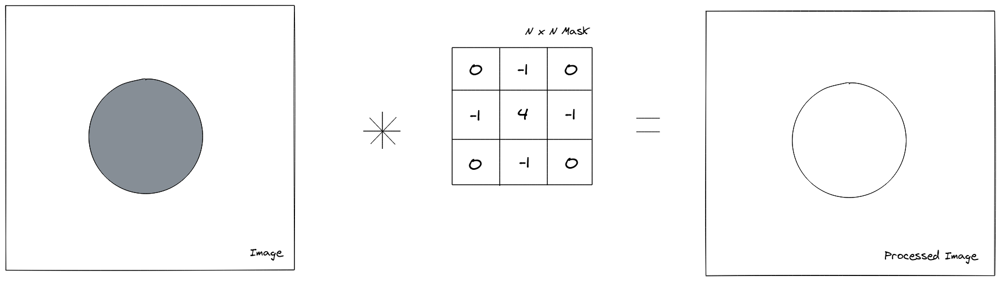
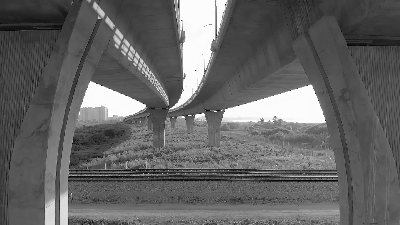
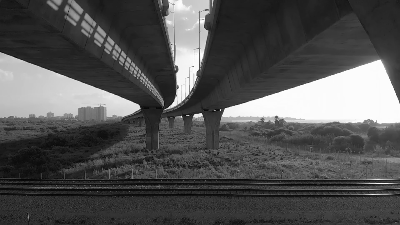
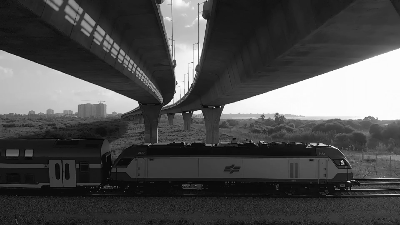
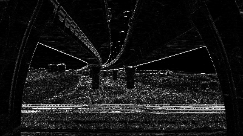
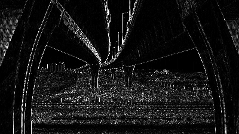
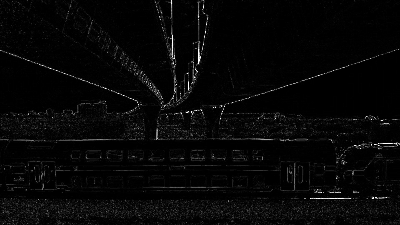
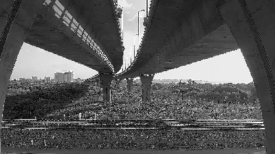

The spatial filter technique is one of the basic tools in image processing, with a simple concept but very powerful applications. The basic concept behind it is that we can gather more information about a pixel by looking at his neighbours and, based on this information, apply an operation on it that will highlight a desired property. This idea, coupled with statistical analysis techniques, is the basis for modern convolutional architecture neural networks, where the filter adapts itself to the data used to train the machine learning model. 

Even though machine learning managed to apply spatial filtering techniques to a wide new range of problem domains, the technique was useful even before neural networks became widespread. This article intends to cover the basics behind these old techniques and how they are applied to image processing problems.


## The spatial filtering process

The spatial filtering operation is done by applying a mask into an image to obtain a new processed image. This mask is applied on a pixel by pixel basis in a process called [convolution](https://en.wikipedia.org/wiki/Convolution). This term derives from a mathematical concept of the same name which defines an operation where two functions are slid one over another, integrating the overlapping parts at every point of the sliding process to generate a new point in the resulting function. In the case of image processing, the convolution is given by sliding the mask over the image and, for every sliding position, multiplying the mask and image in a elementwise manner to generate a new pixel in the resulting image.



This can be also be interpreted as an expansion of an element-wise operation on the image: If you applied an operation on every pixel of the image (e.g. multiplicating by a scalar), the only information you would have is the pixel intensity. If we want to know if that pixel is part of an edge or if it's affected by noise, this is not enough. That's where the mask comes in, which allows the operation to have information about the neighbourhood of the pixel, allowing the operation to have spatial information about the pixel.

In image processing, this operation is mathematically defined by the following equation:

$$
  h(x, y)= \sum_{s=-a}^{a}\sum_{t=-b}^{b} w(s, t) \cdot f(x + s, y+t)
$$

Where $w$ defines the mask, $f$ is the input image and $h(x,y)$ is the resulting image pixel. The graphical interpretation of this operation can be seen in the following image.


*Notice that the operation above resulted into a higher value than the maximum available to an 8 bit range normally used for representing images, because of this, the operation is often done in higher precision data types and the result is rescaled back to the 8 bit range [0, 255].*

The operation in the image above needs to be repeated in every pixel of the image (i.e. the sliding part of the operation). Since it's hard to convey this idea using only images, I'll defer to this [interactive visualization](https://setosa.io/ev/image-kernels/)\* which shows the effect of various masks into an image and allows you to try out different masks values.

Finally it's important to notice that, even though most masks shown here have 3x3 dimensions, this is not a necessity: the masks can have whatever dimensions are deemed necessary, but bigger dimensions incurs into more computational workload.

\* *This visualization/article is very short and I highly recommend reading it for a better understading of the next section*

## Deriving the basic spatial filters

Now we understand how the filtering operation is done in the image, but there's is still one missing piece of the puzzle: How do we define which values will constitute the mask? 

The values used for the most common masks are not defined randomly, they are actually derived from mathematical properties that, when viewed from an image processing perspective, will have the desired effect on the image.

### Smoothing filters

Smoothing filters reduce the amount of drastic intensity variations inside the image, meaning that sharp edges from objects will have smoother transitions between neighbouring intensities. They are mainly used for blurring images and reducing noise.

#### Mean filter

This is one of the most basic filters which simply takes the mean of the neighbourhood values of a pixel, as the name indicates. By averaging the intensity values in image sections, this filter allows for noise to be mitigated, based on the assumption that the neighbouring pixels will have similar intensities, allowing the noise to be cancelled out.

$$
	Mask(x,y) = \frac{1}{M \cdot N}
$$

Applying this mask to the definition of the spatial filtering operation, we obtain:

$$
  h(x, y)= \sum_{s=-a}^{a}\sum_{t=-b}^{b} Mask(s, t) \cdot f(x + s, y+t)
$$

$$
  h(x, y) = \frac{1}{M \cdot N} \sum_{s=-a}^{a}\sum_{t=-b}^{b} f(x + s, y+t)
$$

Which is a simple two-dimensional average operation over the pixels currently under the mask. This mask can be implemented by repeating the constant part over the mask elements:

```Cpp
float mean_mask[] = {
	1./9, 1./9, 1./9,
	1./9, 1./9, 1./9,
	1./9, 1./9, 1./9
};
```
<br/>


#### Median filter

Another mask available is the median filter, which takes the median intensity value between the pixels in the neighbourhood, this allows for pictures which have sharp noise peaks to be improved in such a way that this kind of noise is almost completely removed. 

Even though the convolution process is similar to the other masks (i.e. the mask slides over the whole image), this median operation cannot be implemented by means of an elementwise multiplication between the mask and the image, instead we need to gather the neighbouring pixels, sort them and then take the median intensity.

#### Gaussian filter

Finally, another smoothing filter is the Gaussian Blur filter, which as the names suggests applies an gaussian over the image. This gives more weight to the pixel in the middle of the mask, but still allows neighbouring pixels to have an effect on the result. This kind of blurring might keep edge information better than a simple mean filter, since edge pixels will have a stronger weight than the neighbouring pixels, but will still blur the image as the end result.

The mathematical definition of a bidimensional gaussian function is given by:

$$
	G(x, y) = \frac{1}{2\pi \sigma^{2}} e^{-\frac{x^{2} + y^{2}}{2\sigma^{2}} }
$$

We can approximate the gaussian mask using the following values:

```Cpp
float gauss_mask[] = {
	0.0625, 0.125, 0.0625,
	0.125 , 0.25 , 0.125 ,
	0.0625, 0.125, 0.0625
}
```
<br/>

### Sharpening filters

The filters which accentuate the intensity changes between neighbouring pixels are classified as sharpening filters. They act by approximating function derivatives so that the intensity variation can be estimated, in this way sections of the image where the intensity changes rapidly, such as edges of objects, will be highlighted. The downside of sharpening is that any noise might be accentuated as well.

#### Laplacian filter

The laplacian filter is an approximation of the second-order derivate in both dimensions of the image. Since second order derivatives have the property that it's value is non-zero only when the first-derivative is changing, meaning that areas with constant intensities and areas where the change in intensity is constant (i.e. intensity ramps), will all be zero in the resulting image. 

Also, since the second derivative is positive or negative depending on the change of intensity variation, if there's a quick upwards/downwards change in intensity directly followed by a constant intensity section, as it happens in object edges, there will be a *zero-crossing* (i.e. sign change) in the laplacian operation, which can be used to detect those edges.

$$
	laplacian: \nabla^{2} f = \frac{\partial^{2}{f}}{\partial{x^{2}}} + \frac{\partial^{2}{f}}{\partial{y^{2}}}
$$

The partial derivatives can be approximated, using [finite difference approximation](https://en.wikipedia.org/wiki/Finite_difference), by:

$$
	\frac{\partial^{2}{f}}{\partial{x^{2}}} = f(x+1, y) + f(x-1, y) - 2f(x, y)
$$

$$
	\frac{\partial^{2}{f}}{\partial{y^{2}}} = f(x, y+1) + f(x, y-1) - 2f(x, y)
$$

Finally, after substituting those two equations into the laplacian, we obtain:

$$
	\nabla^{2} f = f(x+1, y)  + f(x-1, y) + f (x, y+1) + f (x, y-1) - 4f(x, y) 
$$

Which gives us the values that are commonly used to implement the laplacian mask:

```Cpp
float laplacian_mask[] = {
	0,  1, 0,
	1, -4, 1,
	0,  1, 0
};

// If the diagonal derivatives are also taken into consideration
float other_laplacian_mask[] = {
	1,  1, 1,
	1, -8, 1,
	1,  1, 1
};

// The negatives of the masks above are also used in practice
```
<br/>

#### Sobel filters

Another derivative based filter are the Sobel masks, which approximate the first-order derivative instead. These masks are well suited to find edges that are in a particular direction. Given that the mask represents a first-order derivative, it'll react to whatever change in intensity happens in the image, while constant sections will be equal to zero.

There are two sobel masks, one the detects edges in the horizontal direction, while the other detects vertical edges.

The derivatives approximations are given below:

**Horizontal**
$$
	\frac{\partial f}{\partial x} = f(x+1, y+1) + 2 f(x, y+1) + f(x-1, y+1) 
$$

$$
	- f(x+1, y-1) - 2f(x, y-1) - f(x-1, y-1)
$$

**Vertical**

$$
	\frac{\partial f}{\partial y} = f(x+1, y-1) + 2 f(x+1, y) + f(x+1, y+1) 
$$

$$
	- f(x-1, y-1) - 2f(x-1, 1) - f(x-1, y+1)
$$

Which can be implemented as follows:

```Cpp
float sobel_vertical[] = {
	-1, -2, -1,
	 0,  0,  0,
	 1,  2,  1
};

float sobel_horizontal[] = {
	-1,  0, 1,
	-2,  0, 2,
	-1,  0, 1
};

// The negatives of the masks above are also used in practice
```
<br/>

#### Laplacian of gaussian filter

The previous filters are good at detecting edges, but since they are based on approximation of derivatives, the noise will be amplified by when the mask is applied on the image. To counter this effect, we could apply a smoothing operation to remove noise before doing the sharpening. This is the idea behind the laplacian of a gaussian mask: the gaussian smooths the image, which then allows the laplacian to have a better effect at sharpening edges.

This is how this mask is derived:

$$
	G(x,y) = e^{- \frac{ x^{2} + y^{2} }{ 2 \sigma^{2}} }
$$

$$
	\nabla^{2} G(x,y) = \frac{\partial^{2}}{\partial x^{2}} G(x,y) + \frac{\partial^{2}}{\partial y^{2}} G(x,y)
$$

Using the chain rule for derivatives:

$$
  \frac{\partial}{\partial x} G(x,y) = - \frac{2x}{2 \sigma^{2}} e^{- \frac{ x^{2} + y^{2} }{ 2 \sigma^{2}} } = - \frac{1}{\sigma^{2}} \cdot x e^{- \frac{ x^{2} + y^{2} }{ 2 \sigma^{2}}}
$$

Now we use the product rule to obtain the second derivative:
$$
  \frac{\partial^2}{\partial x^2} G(x,y) = - \frac{1}{\sigma^{2}} (e^{- \frac{ x^{2} + y^{2} }{ 2 \sigma^{2}}} - x \cdot ( \frac{1}{\sigma^{2}} x e^{- \frac{ x^{2} + y^{2} }{ 2 \sigma^{2}}} ))
$$

$$
  \frac{\partial^2}{\partial x^2} G(x,y) = -\frac{e^{- \frac{ x^{2} + y^{2} }{ 2 \sigma^{2}}}}{\sigma^{2}} + \frac{x^{2} e^{- \frac{ x^{2} + y^{2} }{ 2 \sigma^{2}}}}{\sigma^4}
$$

$$
  \frac{\partial^2}{\partial x^2} G(x,y) = \frac{(x^{2} - \sigma^{2})}{ \sigma^4 } e^{ -\frac{ x^{2} + y^{2} }{ 2 \sigma^{2} } }
$$

If we do the same procedure for the $y$ derivative, we get:

$$
  \frac{\partial^2}{\partial y^2} G(x,y) = \frac{(y^{2} - \sigma^{2})}{ \sigma^4 } e^{ -\frac{ x^{2} + y^{2} }{ 2 \sigma^{2} } }
$$

Which we can substitute in the laplacian equation, to obtain the mask definition:

$$
	\nabla^{2} G(x,y) = \frac{(x^{2} - \sigma^{2})}{ \sigma^4 } e^{ -\frac{ x^{2} + y^{2} }{ 2 \sigma^{2} } } + \frac{(y^{2} - \sigma^{2})}{ \sigma^4 } e^{ -\frac{ x^{2} + y^{2} }{ 2 \sigma^{2} } }
$$

$$
	\nabla^{2} G(x,y) = \frac{(x^{2} + y^{2} - 2\sigma^{2})}{ \sigma^4 } e^{ -\frac{ x^{2} + y^{2} }{ 2 \sigma^{2} } }
$$

We can either pre-compute the values for the mask or create a function that will generate them for us. This is how I did it using OpenCV:

```Cpp
template<int rows, int cols>
cv::Matx<float, rows, cols> laplgauss(int sigma) {
    auto rows_offset = rows / 2;
    auto cols_offset = rows / 2;
    cv::Matx<float, rows, cols> result;
    for (int i = 0; i < rows; i++) {
        for (int j = 0; j < cols; j++) {
            int x = i - rows_offset;
            int y = j - cols_offset;
            float coef = (std::pow(x, 2) + std::pow(y, 2) - 2 * std::pow(sigma, 2)) / std::pow(sigma, 4);
            float expn = std::exp( -(std::pow(x, 2) + std::pow(y, 2)) / (2 * std::pow(sigma, 2)));
            result(i, j) = coef * expn;
        }
    }
    return result;
}
```
<br/>

Now that we've seen a fair amount of spatial filtering masks, let's see them in practice by applying it to a video stream.

## Spatial filtering in action: applying filters to a video stream

An interesting way of putting spatial filtering into practice is to apply the masks to a video stream, which allows us to see the effects in real time. To do this, I'm going to use the OpenCV library:

### Laying out the masks

First thing we need to do is defining the masks that we've discussed in the previous section:

```Cpp
namespace masks {
    const cv::Matx33f MEAN = {
        0.1111, 0.1111, 0.1111,
        0.1111, 0.1111, 0.1111,
        0.1111, 0.1111, 0.1111
    };

    const cv::Matx33f GAUSS = {
        0.0625, 0.125, 0.0625,
        0.125 , 0.25 , 0.125 ,
        0.0625, 0.125, 0.0625
    };

    const cv::Matx33f SOBEL_HORIZONTAL = {
        -1, 0, 1, 
        -2, 0, 2, 
        -1, 0, 1
    };

    const cv::Matx33f SOBEL_VERTICAL = {
        -1, -2, -1, 
         0,  0,  0, 
         1,  2,  1
    };

    const cv::Matx33f LAPLACIAN = {
         0, -1,  0, 
        -1,  4, -1, 
         0, -1,  0
    };

    const cv::Matx33f BOOST = {
         0, -1 ,  0, 
        -1, 5.2, -1, 
         0, -1 ,  0
    };

    const cv::Matx<float,5,5> LAPL_GAUSS = laplgauss<5, 5>(1);
}

void printmask(cv::Mat &m) {
  for (int i = 0; i < m.rows; i++) {
    for (int j = 0; j < m.cols; j++) {
      std::cout << m.at<float>(i, j) << ",";
    }
    std::cout << "\n";
  }
}
```
<br/>

These masks are defined with the `cv::Matx` class which is meant to hold small amounts of data which will be stored on the stack rather than the heap. In addition to that, an `printmask(cv::Mat &)` function was defined, so that we can see which mask is currently selected.

### Opening the video stream

We're going to ask the user for a file path from a video that is stored in the filesystem. This parameter is expected to be given through the command line. If this parameter is not specified, we fall back to the default camera.

I'm using [lyra](https://github.com/bfgroup/Lyra) for an easy to setup command line parsing library.

```Cpp
struct Config {
    const std::string video_path;
};

Config parse_cli(int argc, char* argv[]) {
    std::string file_path{};
    bool show_help = false;

    auto cli = lyra::help(show_help)
        | lyra::opt(file_path, "video path")
            ["-v"]["--video"]
            ("The filesystem path of the video file");

    auto result = cli.parse({ argc, argv });
    if (!result) {
        std::cout << "Error parsing command line: " << result.errorMessage() << std::endl;
        exit(1);
    }

    if (show_help) {
        std::cout << cli << std::endl;
        exit(0);
    }

    return Config { file_path };
}

int main(int argc, char* argv[]) {
    auto config = parse_cli(argc, argv);

    cv::VideoCapture cap;  
    if (config.video_path.empty()) {
        cap.open(0);  // Falls back to default camera
    } else {
        cap.open(config.video_path);
    }

    if (!cap.isOpened()) { // check if we succeeded
        std::cout << "Coudln't open video stream." << std::endl;
        return -1;
    }

    cap.set(cv::CAP_PROP_FRAME_WIDTH, 640);
    cap.set(cv::CAP_PROP_FRAME_HEIGHT, 480);
    double width = cap.get(cv::CAP_PROP_FRAME_WIDTH);
    double height = cap.get(cv::CAP_PROP_FRAME_HEIGHT);

    /*
     * Read video frames and apply masks
     */
}
```
<br/>

We also set the frame dimensions to 640x480. This operation sometimes does not work due to the dimensions requested not being available, another option is to use [cv::resize()](https://docs.opencv.org/4.4.0/da/d54/group__imgproc__transform.html#ga47a974309e9102f5f08231edc7e7529d) to the desired dimensions after reading the frame.

### Reading frames and applying the masks

The last step is to read the video frames and apply the desired mask according to user input. We're going to create two windows: one for the original unprocessed video and the other for the resulting frame after applying the filter. In this way, we are able to compare the effect of the mask on the unfiltered frames.

After this, it's only a matter of reading the frames on a loop and applying the selected mask over it using the `cv::filter2D()` function from OpenCV.

```Cpp
int main(int argc, char* argv[]) {
    /*
     * Read parameters and open video file
     */

    cv::namedWindow("spatial filter", cv::WINDOW_NORMAL);
    cv::namedWindow("original", cv::WINDOW_NORMAL);

    cv::Mat mask (masks::MEAN);

    int absolut = 1;  // calcs abs of the image

    cv::Mat frame, framegray, frame32f, frameFiltered;
    for (;;) {
        cap >> frame;  // get a new frame from camera

        cv::cvtColor(frame, framegray, cv::COLOR_BGR2GRAY);
        cv::flip(framegray, framegray, 1);

        cv::imshow("original", framegray);

        // The filtering is done using 32 bits floating point types
        framegray.convertTo(frame32f, CV_32F);
        cv::filter2D(frame32f, frameFiltered, frame32f.depth(), mask,
                cv::Point(1, 1), 0);

        if (absolut) {
            frameFiltered = cv::abs(frameFiltered);
        }

        frameFiltered.convertTo(result, CV_8U);

        cv::imshow("spatial filter", result);

        // Apply the mask according to the user keyboard input
        char key = (char) cv::waitKey(10);
        if (key == 27) break;  // esc pressed!
        switch (key) {
            case 'a':
                absolut = !absolut;
                break;
            case 'm':
                mask = cv::Mat(masks::MEAN);
                printmask(mask);
                break;
            case 'g':
                mask = cv::Mat(masks::GAUSS);
                printmask(mask);
                break;
            case 'h':
                mask = cv::Mat(masks::SOBEL_HORIZONTAL);
                printmask(mask);
                break;
            case 'v':
                mask = cv::Mat(masks::SOBEL_VERTICAL);
                printmask(mask);
                break;
            case 'l':
                mask = cv::Mat(masks::LAPLACIAN);
                printmask(mask);
                break;
            case 'b':
                mask = cv::Mat(masks::BOOST);
                printmask(mask);
                break;
            case 'i':
                mask = cv::Mat(masks::LAPL_GAUSS);
                printmask(mask);
                break;
            default:
                break;
        }
    }
    return 0;
}
```
<br/>

Finally, these are the results obtained after running this program on this [video](https://www.pexels.com/video/electric-train-for-transportation-in-switzerland-countryside-4789847/).

**Original**



**Mean filter**



**Gaussian filter**



**Sobel Horizontal**



**Sobel Vertical**



**Laplacian filter**



**Laplacian of Gaussian**



*Credits: Pictures taken from this [video](https://www.pexels.com/video/a-railway-under-a-flyover-3250590/) by [SwissHumanity](https://www.pexels.com/@swisshumanity-1686058) on [Pexels](https://www.pexels.com/)*

## Conclusion

Hopefully this article gave you a good overview of some basic spatial filter, the mathematical intuition behind them and how they can be used to find features inside the image. Grasping the convolution of a filter on an image is useful not only in image processing pipelines but also to understand modern neural networks such as [convolutional neural networks](https://en.wikipedia.org/wiki/Convolutional_neural_network) and some [generative adversarial networks](https://en.wikipedia.org/wiki/Generative_adversarial_network) (e.g. DCGAN) which are the state of the art for object detection in computer vision.
