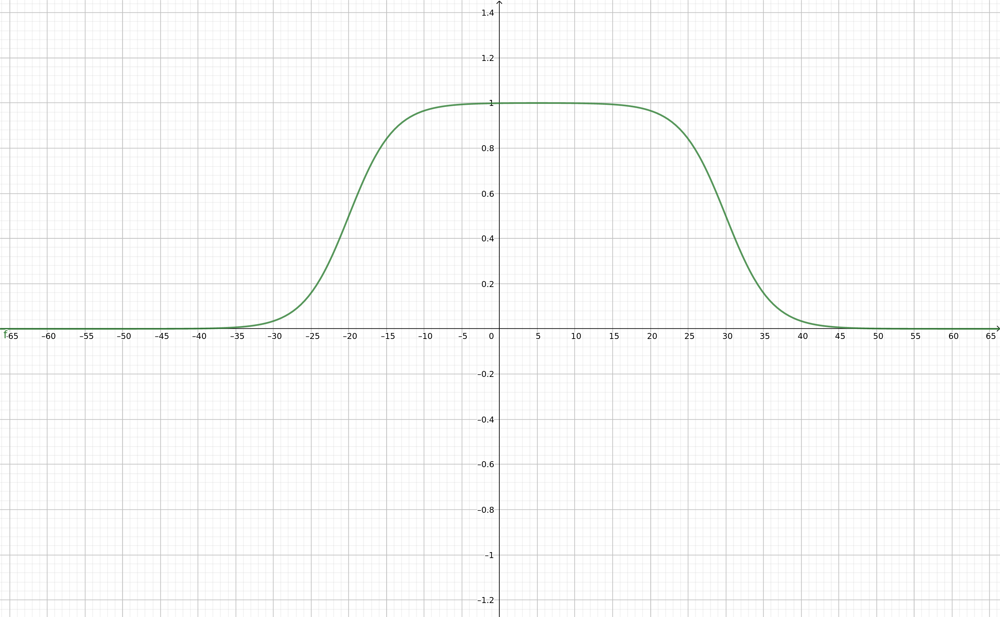

Professional photographers are always looking for effects that highlight interesting portions of a scenery, to achieve that goal they use their mastery of scenery illumination together with some fancy camera lenses that enables them to achieve a desired effect, such as highlighting a person on the foreground, while blurring the background around them. 

Since those cameras require a very complex engineering process to be made, their price is often very expensive, which might keep some aspiring photographers away from the practice. Luckily we can simulate some of these effects in a computer using image processing techniques, this allow us to try out effects without having to buy one of those cameras. 

One interesting effect we can try out is called tilt-shift, which is the result of tilting the camera lenses with relation to the camera sensor in such a way that only a subsection of the scenery is focused. This effect is famous for making the picture look like its a photo of miniature world. Some of these effects can be seen in the images below:

The goal of this post is to try to simulate this effect in post-processing with OpenCV. This simulation might not give all the features you would get with professional camera lenses, but its a interesting way of seeing what image processing is able to do.

## Understanding how to do it

To achieve the effect we need to notice that the original image is blurred in some sections and left unprocessed in others. If you have read the article about [spatial filters](/blog/opencv-spatial-filters) before, you know that we can blur a picture by applying a smoothing filter, which gives part of the effect we want. 

After applying the filter, we have a blurred image together with the non-processed original image. We just need to find a way to blend them such that the effect is similar of the tilt shift. The way we do blending in OpenCV is by means of the [cv::addWeighted()](https://docs.opencv.org/4.4.0/d2/de8/group__core__array.html#gafafb2513349db3bcff51f54ee5592a19) function, which does an elementwise addition of the two images using a specified weight for each. The mathematical operation it implements is given below:

$$
	dst(I) = \alpha \cdot src_{1}(I) + \beta \cdot  src_{2}(I) + \gamma
$$

Where $dst$ represents the destination image, $src_{1}$ and $src_{2}$ are the input images and $\alpha$ and $\beta$ are user defined coefficients\*. To do blending of images, we need to modify it a bit so that the coefficients represent how strong the effect of each image will be in the output. So we get the following equation:

$$
	dst(I) = \alpha \cdot src_{1}(I) + (1 - \alpha) \cdot src_{2}(I)
$$

With this function we get to blend the original and blurred images, but this is still not the effect we want since this will merge both images entirely and we want only certain subsections of it. To fix that, we need to vary the coefficients in such a way that in some sections the blurred image will have bigger effect and in others, the original image will have bigger effect. This is done by using the following function to characterize the coefficients:

$$
	\alpha(x, l1, l2, d) = \frac{\tanh(\frac{x - l1}{d}) - \tanh(\frac{x - l2}{d})}{2}
$$

Where the $l1$ and $l2$ are the transition points in the image, where it changes between blurred to non-blurred, and the parameter $d$ is row fast this transition happens. This might be hard to grasp from the mathematical definition alone, so let's look at it's graph.

\* *OpenCV also does a saturation of the result in order to avoid overflows, this was omitted here so that we are able to focus on what is the purpose of the function.*

## Putting it in practice
