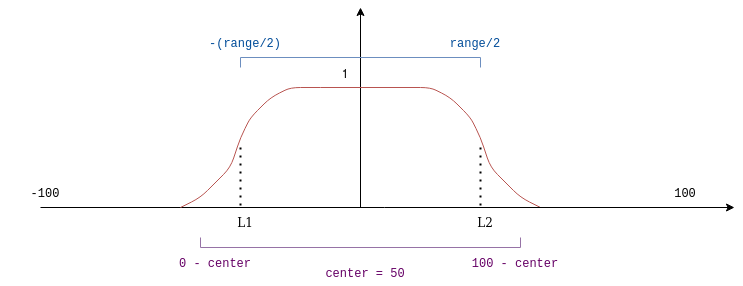

Professional photographers are always looking for effects that highlight interesting portions of a scenery, to achieve that goal they use their mastery of scenery illumination together with some fancy camera lenses that enables them to achieve a desired effect, such as highlighting a person on the foreground, while blurring the background around them. 

Since those cameras require a very complex engineering process to be made, their price is often very expensive, which might keep some aspiring photographers away from the practice. Luckily we can simulate some of these effects in a computer using image processing techniques, this allow us to try out effects without having to buy one of those cameras. 

One interesting effect we can try out is called tilt-shift, which is the result of tilting the camera lenses with relation to the camera sensor in such a way that only a subsection of the scenery is focused. This effect is famous for making the picture look like its a photo of miniature world. Some of these effects can be seen in the images below:


The goal of this post is to try to simulate this effect in post-processing with OpenCV. This simulation might not give all the features you would get with professional camera lenses, but its a interesting way of seeing what image processing is able to do.

## Understanding how to do it

To achieve the effect we need to notice that the original image is blurred in some sections and left unprocessed in others. If you have read the article about [spatial filters](/blog/opencv-spatial-filters) before, you know that we can blur a picture by applying a smoothing filter, which gives part of the effect we want. 

After applying the filter, we have a blurred image together with the non-processed original image. We just need to find a way to blend them such that the effect is similar of the tilt shift. The way we do blending in OpenCV is by means of the [cv::addWeighted()](https://docs.opencv.org/4.4.0/d2/de8/group__core__array.html#gafafb2513349db3bcff51f54ee5592a19) function, which does an elementwise addition of the two images using a specified weight for each. The mathematical operation it implements is given below:

$$
	dst(I) = \alpha \cdot src_{1}(I) + \beta \cdot  src_{2}(I) + \gamma
$$

Where $dst$ represents the destination image, $src_{1}$ and $src_{2}$ are the input images and $\alpha$ and $\beta$ are user defined coefficients\*. To do blending of images, we need to modify it a bit so that the coefficients represent how strong the effect of each image will be in the output. So we get the following equation:

$$
	dst(I) = \alpha \cdot src_{1}(I) + (1 - \alpha) \cdot src_{2}(I)
$$

With this function we get to blend the original and blurred images, but this is still not the effect we want since this will merge both images entirely and we want only certain subsections of it. To fix that, we need to vary the coefficients in such a way that in some sections the blurred image will have bigger effect and in others, the original image will have bigger effect. This is done by using the following function to characterize the coefficients:

$$
	\alpha(x, l1, l2, d) = \frac{\tanh(\frac{x - l1}{d}) - \tanh(\frac{x - l2}{d})}{2}
$$

Where $l1$ and $l2$ are the transition points in the image, where it changes between blurred to non-blurred, and the parameter $d$ is how fast this transition happens. This might be hard to grasp from the mathematical definition alone, so let's look at the graph of this function for the parameters $l1$ = -20, $l2$ = 30 and $d$ = 6.


We can interpret this graph by thinking that in the places where its value is 0 the resulting image will be blurred, and where it's equal to one, the output image will not have any effect applied. In this way, only the regions near the top and bottom section of the picture will be blurred, which gives us an effect similar to the tilt-shift. We are also able to notice that the inflection points of the curves are given by the parameters $l1$ and $l2$, we can use this fact to manipulate which section of the is going to be blurred.

Now we have a way of simulating the tilt-shift: we blur the image and merge the blurred image with the original using a weighted adition, where the weights are given by the function we just defined above. Let's see how to do it using OpenCV.

## Putting it in practice

The first thing we need to do is to translate the coefficient characterization function into a mask that we can apply to the image. The mask we want to create should look like this:


The dark part are the sections of the image in which it will have a lower effect in the result ($\alpha$ = 0), the white part is where the original image will have greater effect ($\alpha$ = 1). We need two masks because one will be applied to the original image and the other one to the blurred image.

To create this mask, we're going to first create an array with size being equal to the image height, filled with discrete samples of the function. This is done by defining the following C++ function:

```Cpp
#include <iostream>
#include <cstdio>
#include <cmath>
#include <opencv2/opencv.hpp>
#include <lyra/lyra.hpp>

#define assertm(exp, msg) assert(((void) msg, exp))

// ------ Blending mask generation -------

// Generates data for a single row of a blending mask given by the function
//
// ( tanh((x - lb) / decay) - tanh((x - hb) / decay) ) / 2
//
// This function will be evaluated between [low_bound] and [high_bound] 
// and will generate a vector with exactly [size] values.
std::vector<float> blend(int min_range, int max_range, int low_bound, int high_bound, int decay, int size) {
    assertm(min_range < max_range, "blend range is defined incorrectly. min_range >= max_range");
    assertm(low_bound <= high_bound, "boundary range is defined incorrectly. low_bound > high_bound");
    assertm(decay != 0, "decay coefficient is equal to zero");

    std::vector<float> lu_table;
    lu_table.reserve(size);                // Preallocate memory since we already know the final size

    float step = (float) (max_range - min_range) / size;
    for (int i = 0; i < size; ++i) {
        float x = min_range + i * step;
        float result = std::tanh((x - low_bound) / decay) - std::tanh((x - high_bound) / decay);
        lu_table.push_back(result / 2);
    }

    return lu_table;
}
```
<br/>

The function does the evaluation of the coefficient characterization function for the range between [*min_range*, *max_range*], sampling it in equal intervals with period defined by *step*. The resulting values are stored into an array and returned to the caller. The assertm function is used to make some simple assertions about its invariants.

After running this function, we get an array with the our desired values, but this is still not the mask we want. To complete the process we need to transpose the array and copy it across across the columns until we have the same width of the image. To do this, we need to define another function:

```Cpp
cv::Mat smooth_blend_mask(
    cv::Size size,
    int min_range,
    int max_range,
    int low_bound, 
    int high_bound, 
    int decay
) {
    cv::Mat mask(size.width, size.height, CV_32FC1);
    auto blend_values = blend(min_range, max_range, low_bound, high_bound, decay, size.height);
    cv::Mat blend_mask_row(1, size.height, CV_32FC1, blend_values.data());

    // Repeat the row with blending values to generate an image mask.
    for (int i = 0; i < size.width; i++) {
        blend_mask_row.copyTo(mask.row(i));
    }

    // The function values were laid out horizontally
    // but we want the mask to be vertical rather than horizontal
    cv::transpose(mask, mask);
    return mask;
}
```
<br/>

In this snippet, I copied the array of data horizontally and transposed the resulting mask, which gives the same result as transposing it first, then copying across the columns.

With the mask ready, we are now able to apply it to the image and see the resulting tilt-shift. But before doing that, let's use the GUI tools from OpenCV so that we can manipulate the effect and have a better understanding of it.

We're going to define three sliders:

- **center** - The middle point of where the mask will be applied in the image
- **decay** - How fast the transition between blurred to non-blurred happens
- **range** - How wide the non-blurred section of the image will be.

```Cpp
// ------  UI slider management -------

// Middle point of the mask
int center = 0;
int center_slider = 0;
int center_slider_max = 100;

// How fast the transition between blurred to not-blurred
// happens
int decay = 1;
int decay_slider = 0;
int decay_slider_max = 39;

// Defines the non-blurred region in the image
int range = 0;
int range_slider = 0;
int range_slider_max = 100;

cv::Mat image, blur_mask, blurred_image;
cv::Mat weighted_blur, weighted_image, blended;
cv::Mat imageTop;

char trackbar_name[50];

void do_blending() {
    auto min_range = 0 - center;
    auto max_range = 100 - center;
    auto low_bound = -range / 2;
    auto hi_bound = +range / 2;

    blur_mask = smooth_blend_mask(
        image.size(), 
        min_range,
        max_range,
        low_bound, 
        hi_bound, 
        decay
    );

    cv::Mat bgr_mask;
    // Makes the single channel mask into a three channel image 
    cv::cvtColor(blur_mask, bgr_mask, cv::COLOR_GRAY2BGR);
    auto inverse_mask = CV_RGB(1, 1, 1) - bgr_mask;

    cv::multiply(bgr_mask, image, weighted_image);
    cv::multiply(inverse_mask, blurred_image, weighted_blur);
    cv::add(weighted_image, weighted_blur, blended);
    
    blended.convertTo(blended, CV_8UC3);
    cv::imshow("addweighted", blended);
}

void on_trackbar_center_changed(int, void*) {
    center = center_slider;
    do_blending();
}

void on_trackbar_decay_changed(int, void*) {
    decay = 1 + decay_slider;
    do_blending();
}

void on_trackbar_range_changed(int, void*) {
    range = range_slider;
    do_blending();
}
```
<br/>

The most interesting part of the snipper above is the *do\_blending()* function, which starts with the definition of the ranges in which the coefficient function will be evaluated and the center variable, which is not the center of the mask, nor the center of the image, but rather a mapping between the image and the mask: When *center = 0* the center of the function is at the start of the image, when *center = 50* the center of the function is at the middle of the image and when *center = 100*, the center of the function is at the end of the image.

This is easier to see with an image depiction:

When *center = 0* :


When *center = 50* :




When *center = 100* :


You can think about the vertical axis of the image being the purple line at the pictures above.

Finally, we can join everything together and see the results.

```Cpp
#include <iostream>
#include <cstdio>
#include <cmath>
#include <opencv2/opencv.hpp>
#include <lyra/lyra.hpp>

#define assertm(exp, msg) assert(((void) msg, exp))

struct Config {
    const std::string image_path;
    const int height;
    const int width;
};

Config parse_cli(int argc, char* argv[]) { /* parse cli arguments */ }

/* blending function */

/* blending mask function */

/* ui trackbars and listeners */

const cv::Matx33f blur_filter = {
    1./9, 1./9, 1./9,
    1./9, 1./9, 1./9,
    1./9, 1./9, 1./9
};

int main(int argc, char* argv[]) {
    auto config = parse_cli(argc, argv);
    image = cv::imread(config.image_path);

    cv::Size image_size { config.width, config.height };
    cv::resize(image, image, image_size);

    image.convertTo(image, CV_32FC3);
    image.copyTo(blurred_image);
    // We apply blurring multiple times so the
    // effect is more visible
    for (int i = 0; i < 5; ++i) {
        cv::filter2D(
            blurred_image, 
            blurred_image, 
            blurred_image.depth(), 
            blur_filter
        );
    }

    // Creating the trackbars 
    cv::namedWindow("addweighted", 1);
    std::sprintf(trackbar_name, "Center x %d", center_slider);
    cv::createTrackbar(trackbar_name, "addweighted",
            &center_slider,
            center_slider_max,
            on_trackbar_center_changed);
    on_trackbar_center_changed(center_slider, nullptr );

    std::sprintf(trackbar_name, "Decay x %d",  decay_slider);
    cv::createTrackbar(trackbar_name, "addweighted",
            &decay_slider,
            decay_slider_max,
            on_trackbar_decay_changed );
    on_trackbar_decay_changed(decay_slider, nullptr );

    std::sprintf(trackbar_name, "Range x %d",  range_slider);
    cv::createTrackbar(trackbar_name, "addweighted",
            &range_slider,
            range_slider_max,
            on_trackbar_range_changed );
    on_trackbar_range_changed(range_slider, nullptr );

    cv::waitKey(0);
    return 0;
}
```
<br/>

*To parse the command line arguments I've used the [lyra](https://github.com/bfgroup/Lyra) library, but you can use whatever library you prefer.*

This is the result we get when running the binary on [this image](https://www.flickr.com/photos/romainguy/50386634128/in/dateposted-public/) with the parameters *center = 58*, *decay = 10* and *range = 45*:


We can see that the effect on the image is very similar to the tilt-shift made by professional camera lenses, where the center is focused and the borders are blurred.


