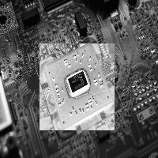

## Image manipulation

One of the most basic tasks when manipulating images is to apply a certain operation to a subsection of an image. We might want to enhance a certain portion of an image so that it becomes hightlighted or apply an special effect to an specified region. The OpenCV library offers several ways of doing these operations, which I'm hoping to show with simple examples in this article.

To show these different kinds of operations, we'll make a simple program that changes a subsection of an image to it's negative counterpart. Wikipedia defines a [negative image](https://en.wikipedia.org/wiki/Negative_(photography)) as such:

> In photography, a negative is an image, usually on a strip or sheet of transparent plastic film, in which the lightest areas of the photographed subject appear darkest and the darkest areas appear lightest.

So the program needs to take an image and change it's light section to dark and vice-versa. We need to ask the user to specify two points in the image that defines the top left and lower right corners of a rectangular section in which we'll apply our operation. To make our life easier, we'll resize the image so it's 200 x 200 pixels and check for out of bounds access.

### The naive way

If you think about an image as a 2D array, the first way that comes to mind of manipulating the image is to use two *for* loops and change the pixels one by one. OpenCV offers two functions to access the pixels in an image:

- [Mat::at(x, y)](https://docs.opencv.org/4.4.0/d3/d63/classcv_1_1Mat.html#ac40425b84f60b39fd35e03814122661f) - Returns a reference to the value at row x and column y.
- [Mat::ptr(x, y)](https://docs.opencv.org/4.4.0/d3/d63/classcv_1_1Mat.html#abda2b96aa438a808b43425040a7da81a) - Returns a pointer to the value at row x and column y.

These functions have several overloaded definitions so that we're able to return the correct pointer type for the different data types that cv::Mat can take. If you don't specify the type, a simple pointer to `unsined char` will be returned, even if this is not the type your Mat contains and we'll need to be careful when doing pointer arithmetic.

With this in mind, let's do our first implementation of the program using one of these member functions.

```Cpp
#include <iostream>
#include <opencv2/opencv.hpp>
#include <cxxopts.hpp>

struct Config {
	const std::string file_path;              // filepath of the image
	const std::pair<int, int> top_left;       // top left x & y coordinates
	const std::pair<int, int> lower_right;    // lower right x & y coordinates
}

Config parse_cli(int argc, char* argv[]) { /* parse cli */ }

/*
 * Naive way of doing it.
 */
int main(int argc, char* argv[]) {
    auto config = parse_cli(argc, argv);

    cv::Mat image = cv::imread(config.file_path, cv::IMREAD_GRAYSCALE);

    // Resizing the image to 200x200
    cv::Mat small_image;
    cv::Size size { 200, 200 };
    cv::resize(image, small_image, size);

    // Renaming because Point2i has better attribute names than std::pair
    cv::Point2i top_left { config.top_left.first, config.top_left.second };
    cv::Point2i lower_right { config.lower_right.first, config.lower_right.second };

    // Iterate through the region 
    for (int i = top_left.x; i < lower_right.x; i++) {
        for (int j = top_left.y; j < lower_right.y; j++) {
            uchar *value = small_image.ptr<uchar>(i, j);
            *value = 255 - *value;          // Do the 8-bit inversion to obtain the negative
        }
    }

    cv::imshow("negative", small_image);
    cv::waitKey();
}
```
<br/>
<p>
With this implementation we can run our binary in the command line: 
</p>

```bash{promptUser: edujtm}
./regions chip-grayscale.jpg --tlx 50 --tly 55 --lrx 160 --lry 150
```
<br/>
<p>
And we obtain the desired result:
</p>



The interesting part of the code snippet above is the two for loops:

```cpp
// Iterate through the region 
for (int i = top_left.x; i < lower_right.x; i++) {
    for (int j = top_left.y; j < lower_right.y; j++) {
        uchar *value = small_image.ptr<uchar>(i, j);
        *value = 255 - *value;          // Do the 8-bit inversion to obtain the negative
    }
}
```
<br/>

In this we're asking the library to calculate the offset from the start of the underlying data array where our pixel is located, then saving the result of 255 minus the value in that position. The problem with this implementation is that to calculate the offset, we need to do a multiplication to find the row and then a sum to find the column **for every pixel** in our region. This [answer on stackoverflow](https://stackoverflow.com/a/25224916/8310836) explains this problem and gives a way around it.

### Using ROI operators

Since we're applying the same operation in every pixel inside the region, we can use a broadcast operation inside the region of interest, which will make our code shorter and more legible. 

OpenCV overrides the [Mat::operator()](https://docs.opencv.org/4.4.0/d3/d63/classcv_1_1Mat.html#ad543b6bd296ae1247032c750af4718e1) so we can extract subregions of an image. This extracted subsection is not a copy of the values, only a copy of the header that points to the same underlying data array. In this way, operations on the extracted submatrix will be reflected on the original image.

```Cpp
/*
 * ROI and broadcasting.
 */
int main(int argc, char* argv[]) {
    auto config = parse_cli(argc, argv);

    cv::Mat image = cv::imread(config.file_path, cv::IMREAD_GRAYSCALE);

    // Resizing the image to 200x200
    cv::Mat small_image;
    cv::Size size { 200, 200 };
    cv::resize(image, small_image, size);

    // Renaming because Point2i has better attribute names than std::pair
    cv::Point2i top_left { config.top_left.first, config.top_left.second };
    cv::Point2i lower_right { config.lower_right.first, config.lower_right.second };

    // A better way using region of interest 
    int height = lower_right.x - top_left.x;
    int width = lower_right.y - top_left.y;
    cv::Rect roi { top_left.x, top_left.y, width, height };

    // Obtains a view of the section in which we're going to make the operation;
    cv::Mat image_roi = small_image(roi);
    // Applies a broadcasting operation
    image_roi = 255 - image_roi;

    cv::imshow("negative", small_image);
    cv::waitKey();
}
```
<br/>
<p>
If we run our binary with this implementation:
</p>

```bash{promptUser: edujtm}
./regions chip-grayscale.jpg --tlx 20 --tly 20 --lrx 100 --lry 60
```

We get the desired results again:


### Using bitwise operators

Since a grayscale image with one channel is represented by 8 bits values. We can use bitwise operators to invert our image. If we invert the bits from each pixel, we get the same value as subtracting the intensity value from 255.

- 0 (0b0000\_0000) -> 255 (0b1111\_1111)
- 1 (0b0000\_0001) -> 254 (0b1111\_1110)
- 2 (0b0000\_0010) -> 253 (0b1111\_1101)

And so on...

With this in mind, we can rewrite our operation using the [cv::bitwise\_not](https://docs.opencv.org/4.4.0/d2/de8/group__core__array.html#ga0002cf8b418479f4cb49a75442baee2f) operation.

```Cpp
/*
 * ROI and bitwise operation.
 */
int main(int argc, char* argv[]) {
    auto config = parse_cli(argc, argv);

    cv::Mat image = cv::imread(config.file_path, cv::IMREAD_GRAYSCALE);

    // Resizing the image to 200x200
    cv::Mat small_image;
    cv::Size size { 200, 200 };
    cv::resize(image, small_image, size);

    // Renaming because Point2i has better attribute names than std::pair
    cv::Point2i top_left { config.top_left.first, config.top_left.second };
    cv::Point2i lower_right { config.lower_right.first, config.lower_right.second };

    // A better way using region of interest 
    int height = lower_right.x - top_left.x;
    int width = lower_right.y - top_left.y;
    cv::Rect roi { top_left.x, top_left.y, width, height };

    // Obtains a view of the section in which we're going to make the operation;
    cv::Mat image_roi = small_image(roi);
    // Applies a bitwise_not operation
    cv::bitwise_not(image_roi, image_roi);

    cv::imshow("negative", small_image);
    cv::waitKey();
}
```
<br/>
<p>
If you run the resulting binary, you'll get the same results as before.
</p>

### Performance comparison

The last question remaining is if this refactoring is worth it in terms of performance. If the performance gain of using the bitwise operator is not substantial, we might opt to use a simpler implementation.

To test performance of the three scripts, I used the [original image](https://unsplash.com/photos/vruAZdZzQR0) which has a size of 3632 x 5456 pixels and removed the constraint on the image being 200 x 200. After that I wrapped the operations for the three scripts with calls to [std::chrono](https://cplusplus.com/reference/chrono/) and ran the scripts to invert an subregion of 1000 x 1000 pixels.


```Cpp
    auto begin = std::chrono::steady_clock::now();

    // A better way using region of interest 
    int height = lower_right.x - top_left.x;
    int width = lower_right.y - top_left.y;
    cv::Rect roi { top_left.x, top_left.y, width, height };

    // Obtains a view of the section in which we're going to make the operation;
    cv::Mat image_roi = image(roi);
    // Applies a broadcasting operation
    cv::bitwise_not(image_roi, image_roi);

    auto end = std::chrono::steady_clock::now();

    std::cout << "Time elapsed (roi-bitwise): " << 
          std::chrono::duration_cast<std::chrono::microseconds>(end - begin).count() 
          << "[us]" << std::endl;
```
<br />
These were the obtained results: 
<br/><br/>

|Script | Time elapsed |
| ---- | ---- |
| for-loop | 3855 [&#181s] |
| roi-broadcasting | 265 [&#181s] |
| roi-bitwise | 163 [&#181s] |

I've ran the scripts multiple times and the execution time fluctuate around these values. As we can see the for-loop version is an order of magnitude slower and we should avoid using it if there's a better option available.

### One more example of region of interest operators

Another example where region of interest operators might be useful is when creating a quadrant shift of an image where you shift the top left quadrant with the lower right and the top right with the lower left. An example is as follows:


At first sight, it might seem like we need to iterate through the half the image, calculate the new position for the pixel and then change places between them, but this can be achieved in a simpler way using one region of interest for each quadrant of the image and the copying the values between them. The implementation is given below:

```Cpp
int main(int argc, char* argv[]) {
    auto file_path = parse_cli(argc, argv); 

    // Read the image
    cv::Mat image = cv::imread(file_path, cv::IMREAD_GRAYSCALE);

    cv::Mat squared_image;
    cv::Size size { 200, 200 };
    cv::resize(image, squared_image, size);
    image = squared_image;

    cv::imshow("before", image);

    // Quadrants
    cv::Rect top_left { 0, 0, image.rows / 2, image.cols / 2 };
    cv::Rect lower_left { image.rows / 2, 0, image.rows / 2, image.cols / 2 };
    cv::Rect top_right { 0, image.cols / 2, image.rows / 2, image.cols / 2 };
    cv::Rect lower_right { image.rows / 2, image.cols / 2, image.rows / 2, image.cols / 2 };

    // shifting quadrants
    cv::Mat temp = cv::Mat::zeros(image.rows / 2, image.cols / 2, CV_8UC1);

    // Changing top_left with lower_right
    auto top_left_view = image(top_left);
    auto lower_right_view = image(lower_right);

    top_left_view.copyTo(temp);
    lower_right_view.copyTo(top_left_view);
    temp.copyTo(lower_right_view);
    
    // Changing top_right with lower_left
    auto top_right_view = image(top_right);
    auto lower_left_view = image(lower_left);

    top_right_view.copyTo(temp);
    lower_left_view.copyTo(top_right_view);
    temp.copyTo(lower_left_view);

    cv::imshow("after shifting", image);
    cv::waitKey();
}
```
<br/>
<p>
After a few copies data copies, we obtain the desired quadrant shift. This is much more legible than if we were to calculate the new position for each pixel in a for loop. 

The problem with this implementation is that it assumes that the image width and height are divisible by 2. A better implementation would check the size of the image and treat this accordingly.
</p>
