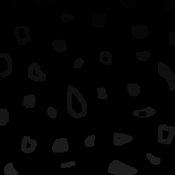
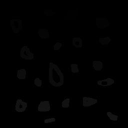

Devido a quantidade variada de padrões em uma imagem, não é simples selecionar regiões de interesse complexas na imagem de modo a fazer operações nelas. Nós precisamos de algum modo de fazer esta região se testacar do resto da figura, mas ainda precisamos lidar com ruídos, formas complexas na imagem e outros objetos que podem estar no meio do nosso objetivo.

Uma forma de abordar esse problema é tentando gerar uma imagem binária que destaca as regiões da imagem que nós podemos estar interessados. Já que imagem binárias só possuem dois valores possíveis, nós podemos então utilizar todos os outros valores representáveis para marcar regiões para pós-processamento e agir de acordo com cada marcação. Assumindo que essas regiões sejam separadas pelo fundo da imagem, nós podemos usar [cv::floodFill()](https://docs.opencv.org/4.4.0/d7/d1b/group__imgproc__misc.html#gaf1f55a048f8a45bc3383586e80b1f0d0) para marcar as diferentes regiões que estamos interessados.

A função `cv::floodFill()` funciona da mesma forma que a funcionalidade de "balde" que está presente emdiversos programas de manipulação de imagens disponíveis. Ela preenche todos os pixels vizinhos com intensidades similares ao do ponto inicial com uma nova intensidade especificada pelo usuário. A API disponível no OpenCV para o algoritmo flood fill é mostrada abaixo:

```Cpp
int cv::floodFill(
	cv::InputOutputArray image,       // A imagem em qual uma região será preenchida com newVal
	cv::Point seedPoint,              // O ponto na imagem onde começar o preenchimento 
	cv::Scalar newVal,                // A nova intensidade/cor 
	cv::Rect *rect = 0,               // Um cv::Rect que define os limites da area preenchida
	cv::Scalar lowDiff = Scalar()     // O limite de intensidade mínimo para um pixel ser preenchido 
	cv::Scalar highDiff = Scalar()    // O limite de intensidade máximo para um pixel ser preenchido 
	int flags                         // Um número de flags que alteram o funcionamento do algoritmo (e.g. o tipo de conectividade)
)
```
<i>Existe uma outra definição dessa função que aceita uma máscara para selecionar quais pixels são preenchidos, mas que funciona da mesma forma. A máscara também tera as regiões pintadas na imagem como valores não-nulo após a execução do algoritmo.</i>

Vamos ver um exemplo de como nós podemos utilizá-la para selecionar regiões.

## Resolvendo um problema de marcação

Digamos que, após processar uma imagem, nós obtemos a seguinte imagem binária com bolhas brancas dentro.


Suponha que nós temos a tarefa de contar o número de bolhas da imagem, utilizando algum algoritmo de nossa escolha. Comos nós podemos resolver essa tarefa? é fácil contar as bolhas visualmente, mas não é simples dar essa mesma informação para o computador. Se nós tentarmos contar pixels brancos, nós precisamos ter certeza que não iremos contar a mesma região mais de uma vez. Para evitar isso, nós precisamos remover todos os outros pixels que pertence a uma região quando nós encontramos o primeiro pixel dela, para isso que é utilizado o flood fill.

Essa ideia pode ser implementada da seguinte forma:

```Cpp
int objects_qnt = 0;
cv::Mat image = /* imagem binária */

for (int i = 0; i < image.rows; i++) {
	// Otimização que evita recalcular o deslocamento da linha em
	// todos os pixels
	uchar* row_ptr = image.ptr<int>(i);  

	for (int j = 0; j < image.cols; j++, row_ptr++) {
		if (*row_ptr == 255) {
			cv::Point loc { j, i };
			objects_qnt++;
			// Nos marcamos a região com objects_qnt
			cv::floodFill(image, loc, objects_qnt);
		}
	}
}
```
<br/>

É importante notar que há uma troca de eixos entre as coordenadas da imagem (i, j) e a instanciação da classe `cv::Point { j, i }`. A notação de matriz possui indexação (linha, coluna) enquanto o ponto possui uma representação com x para horizontal e y para vertical. Essa mudança é ilustrada abaixo:


A implementação acima irá contar todas as bolhas dentro da figura e deixará elas marcadas para pós processamento. O problema aqui é que não podemos contar mais que o limite máximo representavel por um tipo **unsigned char**. Assim que chegarmos a 255 objetos, a região será repintada em branco e contada multiplas vezes.

Para evitar isso, precisamos convert a imagem para outro tipo, mas `cv::floodFill()` funciona apenas com imagens do tipo **inteiro 8 bits** e **ponto flutuante**. Dadas essas opções, nós podemos escolher o tipo **float** que nós dará um limite grande para contagem. o OpenCV nos dá a função [Mat::convertTo()](https://docs.opencv.org/4.4.0/d3/d63/classcv_1_1Mat.html#adf88c60c5b4980e05bb556080916978b) que modifica o tipo usado para representar dados na imagem, mas não redimensiona os valores para a nova faixa. Com essas restrições, nos chegamos a seguinte solução:

```Cpp
/*
 * O template é utilizado aqui para que possamos redimensionar vários tipos de dado.
 */
template<typename DataType>
cv::Mat rescale_intensities(cv::Mat input, DataType new_min, DataType new_max) {
    static_assert(std::is_arithmetic<DataType>::value, "data type for rescaling intensities must be numeric");

    cv::Mat temp = input.clone();
    double input_min, input_max;
    cv::minMaxLoc(temp, &input_min, &input_max);

    cv::Mat result = (new_max - new_min) * (temp - input_min) / (input_max - input_min) + new_min;
    return result;
}

int main() {
    /* código para processamento da imagem */

    // O modo que nós contamos o objeto é dependente do
    // tipo de dado utilizado para representar a imagem.
    // A quantidade máxima de objetos que nós podemos contar
    // é definida pela valor máximo representável pelo tipo.
    cv::Mat float_image = /* alguma imagem binária */;
    image.convertTo(float_image, CV_32FC1);

    // convertTo apenas modifica o tipo, nós ainda precisamos
    // redimensionar as intensidades da imagem.
    cv::Mat rescaled_image = rescale_intensities(int_image, (float) 0., std::numeric_limits<float>::max());

    /* código para pós processamento da imagem */
}
```
<br/>

Isso mapeia a intensidade antiga para a faixa de valores inteira que o tipo float consegue representar.
 O mapeamento é feito pela seguinte função:

$$
  f(x, a, b)  = \frac{(b - a) (x - x_{min})}{x_{max} - x_{min}} + a
$$

Que mapeia um valor $x$ com valor mínimo $x_{min}$ e valor maximo $x_{max}$ para um nova faixa de valores entre $a$ e $b$. Nós podemos observar que caso $x$ seja igual a $x_{min}$, o resultado será igual a $a$ e caso $x$ seja igual a $x_{max}$, então o resultado será igual ao novo valor máximo $b$. Ao mapear para uma nova faixa de valores, nos evitamos qualquer problema que ocorreria quando o contador chegasse em 255, que é o valor utilizado na faixa antiga.

Com isso, nós chegamos a solução final para o problema de contagem de bolhas:

```Cpp
int main() {
    cv::Mat float_image = /* imagem binária */;
    image.convertTo(float_image, CV_32FC1);

    cv::Mat rescaled_image = rescale_intensities(int_image, (float) 0., std::numeric_limits<float>::max());

    float object_qnt = 0.0;
    for (int i = 0; i < image.rows; i++) {
      float* row_ptr = rescaled_image.ptr<float>(i);  

      for (int j = 0; j < image.cols; j++, row_ptr++) {
        if (std::abs(*row_ptr - std::numeric_limits<float>::max()) < 0.001) {
          cv::Point loc { j, i };
          object_qnt++;
          cv::floodFill(image, loc, objects_qnt);
        }
      }
    }

    std::cout << "The figure has " << object_qnt << " bubbles." << std::endl;
}
```
  <br/>

Note que nós estamos agora utilizado uma igualdade por aproximação devido à erros de arrendondamento em tipos ponto flutuante. Executar o binário nos dá o resultado:

```bash{promptUser: edujtm}{outputLines: 2}
./build/labeling ../bubbles.png
The figure has 32 bubbles.
```
<br/>

Se nos convertemos a imagem para **unsigned char** e mostrarmos com `cv::imshow()`, nós obtemos a seguinte imagem:



Nos podemos ver uma variação bem leve de intensidade entre as regiões marcadas e o fundo da imagem. Mostrar a imagem dessa forma só funciona pois existem menos de 255 bolhas nela. Se a imagem tivesse mais que isso, nós teriamos que redimensionar as intensidades para a faixa [0.0, 1.0], mas não haveria muita informação visual. O valor da marcação na imagem se dá pelo seu uso em outros passos de processamento posteriores, que nós iremos ver na próxima seção.

## Contando buracos: utilizando flood fill em uma pipeline

Nós estamos felizes com nosso contador de bolhas, mas uma nova tarefas nos foi dada: nós precisamos contar o número de buracos dentro das bolhsa, já que eles representam falhas de manufatura. Nós podemos assumir que: 

- Nós não precisamos cnotar bolhas que tocam a borda da imagem
- Objetos com mais de um buraco podem existir

Do contador de bolhas que nós desenvolvemos, nós já sabemos como contar e marcar as bolhas, mas agora nós precisamos de alguma forma detectar os buracos dentro delas. Nós sabemos que quatros invariantes existem após o processo de marcação:

1. O fundo da imagem terá intensidade igual a 0
2. As bolhas terão intensidade diferente de 0
3. Os buracos também terão intensidade igual a 0
4. Buracos são rodeados por pixels de bolhas, senão eles seriam parte do fundo da imagem

Do segundo e quarto pontos, nós podemos deduzir um algoritmo que encontra buracos: Se nós acharmos um pixel com intensidade igual a 0, nós checamos se o pixel a esquerda possui intensidade diferente de 0. Se isso for verdadeiro, então nós encontramos um buraco. Nós não queremos repetir essa checagem em todos os pixels do background, então nós podemos pintar o background com o maior valor possível, desse modo apenas os buracos terão intensidade igual a 0. É preciso também ter cuidado para nao ler pixels fora da borda, mas já que não é necessário contar bolhas na borda, nós podemos retirá-las de modo que todos os pixels da borda farão parte do fundo e logo serão pintados de branco.

Vamos ver como podemos implementar isso passo a passo.

### Removendo pixels da borda

Remover bolhas da borda não é muito complexo: se nós acharmos qualquer pixel branco na borda da imagem, nó pintamos de preto utilizando flood fill. Um modo de implementar isso é mostrado abaixo:

```Cpp
/* template para legibilidade (std::numeric_limits é um nome um pouco longo) */
template<typename T>
using limits = std::numeric_limits<T>

void remove_bubbles_at_border(cv::Mat_<float> input) {
    for (int i = 0; i < input.cols; i++) {
        // Remove bolhas que tocam a borda de cima
        if (std::abs(input.at<float>(0, i) - limits<float>::max()) < 0.001) {
            cv::Point location { i, 0 };
            cv::floodFill(input, location, 0.0);
        }

        // Remove bolhas que tocam a borda de baixo
        if (std::abs(input.at<float>(input.rows - 1, i) - limits<float>::max()) < 0.001) {
            cv::Point location { i, input.rows - 1 };
            cv::floodFill(input, location, 0.0);
        }
    }

    for (int i = 0; i < input.rows; i++) {
        // Remove bolhas que tocam a borda esquerda
        if (std::abs(input.at<float>(i, 0) - limits<float>::max()) < 0.001) {
            cv::Point location { 0, i };
            cv::floodFill(input, location, 0.0);
        }

        // Remove bolhas que tocam a borda direita
        if (std::abs(input.at<float>(i, input.cols - 1) - limits<float>::max()) < 0.001) {
            cv::Point location { input.cols-1, i };
            cv::floodFill(input, location, 0.0);
        }
    }

}
```
<br/>

Após aplicar essa função na imagem, esse é o resultado obtido:


### Contando e marcando bolhas

Agora nós precisamos contar e marcar as bolhas. Nós já fizemos isso na primeira parte deste artigo, então nós vamos apenas mover a implementação para uma função.

```Cpp
float count_and_label_bubbles(cv::Mat_<float> input) {
    int width = input.cols;
    int height = input.rows;

    cv::Point p { 0, 0 };
    float object_qnt = 0;
    try {
        for (int i = 0; i < height; i++) {
            float* row_ptr = input.ptr<float>(i);
            for (int j = 0; j < width; j++, row_ptr++) {
                if (std::abs(*row_ptr - limits<float>::max()) < 0.001) {
                    object_qnt++;
                    p.x = j;
                    p.y = i;
                    cv::floodFill(input, p, object_qnt);
                }
            }
        }
    } catch (const cv::Exception& e) {
        std::cout << "Exception occurred: " << e.what() << std::endl;
        exit(1);
    }

    return nobjects;
}
```
<br/>

Com o resultado após esse passo sendo similar ao que obtemos na primeira parte:



A imagem parece ser totalmente escura, mas existem bolhas marcadas dentro dela.

### Pintando o fundo de branco

Já que nós sabemos que não existem bolhas na borda, nós podemos assumir que todos os pixels da borda fazem parte do fundo da imagem. Se nós fizermos um flood fill em qualquer um deles, o fundo da image se tornará da cor escolhida. Escolheremos o canto superior esquerdo.

```Cpp
void fill_background(cv::Mat_<float> input, float value) {
    cv::Point top_right { 0, 0 };
    cv::floodFill(input, top_right, value);
}
```
<br/>

Após esse passo, nós temos uma imagem como essa:


### Contando buracos

Agora nós temos tudo necessário para contar os buracos. Os únicos pixels que ainda são iguais a 0 são aqueles que pertence aos buracos então nós podemos repetir o mesmo processo que usamos ao contar bolhas: se nós acharmos um pixel igual a 0, aumentamos o contador e utilizamos o flood fill para remover a região. Nós também iremos remover a bolha, para que possamos ver quais bolhas foram removidas.

```Cpp
float count_holes(cv::Mat_<float> input) {
    float nholes = 0;
    for (int i = 0; i < input.rows; i++) {
        float* row_ptr = input.ptr<float>(i);
        for (int j = 0; j < input.cols; j++, row_ptr++) {
            if (std::abs(*row_ptr - 0.0) < 0.001) {
                cv::Point location { j, i };
                // Nós não precisamos lidar com bordas
                // já que removemos as bolhas de lá
                cv::Point previous { j-1, i };

                cv::floodFill(input, location, limits<float>::max());
                cv::floodFill(input, previous, limits<float>::max());
                nholes++;
            }
        }
    }

    return nholes;
}
```
<br/>

Após executar esse passo da pipeline, nós podemos ver que as bolhas com buracos foram removidas.


### A pipeline completa

O último passo é apenas executar as funções em ordem.

```Cpp
int main(int argc, char* argv[]) {
    auto config = parse_cli(argc, argv);

    cv::Mat image = cv::imread(config.input_path, cv::IMREAD_GRAYSCALE);
    if (!image.data) {
        std::cout << "Couldn't load specified image" << std::endl;
        exit(1);
    }

    cv::Mat cloned_image = image.clone();
    
    // faz a conversão de tipo e intensidade
    cloned_image.convertTo(cloned_image, CV_32FC1);
    cloned_image = rescale_intensities(cloned_image, (float) 0., limits<float>::max());

    // Inicia a pipeline (todas as operações assumem tipo ponto flutuante 32 bits)
    remove_bubbles_at_border(cloned_image);
    float nobjects = count_and_label_bubbles(cloned_image); 
    fill_background(cloned_image, limits<float>::max());
    float nholes = count_holes(cloned_image);

    cv::Mat visible_image = rescale_intensities(cloned_image, limits<uchar>::min(), limits<uchar>::max());
    std::cout << "The figure has " << nobjects << " bubbles" << std::endl;
    std::cout << "The figure has " << nholes << " holes." << std::endl;
    cv::imshow("initial_image", image);
    cv::imshow("result", visible_image);
    cv::waitKey();

    return 0;
}
```
<br/>

O que nos dá o resultado esperado:

```bash{promptUser: edujtm}{outputLines: 2-3}
./build/count_holes ../bubbles.png
The figure has 21 bubbles.
The figure has 7 holes.
```
<br/>

## Conclusão

Espero que esse exemplo ajude a esclarecer como podemos utilizar flood fill para marcar regiões de intensidade similar para pós processamento. Nós podemos combinar passos de pré-processamento como, por exemplo, aplicar um filtro canny para tentar separar regiões e então usar flood fill para marcá-las para processamento posterior. Um exemplo disso onde isto poderia ser útil seria na simulação de um efeito tela verde, onde nós marcariamos todos os pixels verdes com um valor constante e então trocariamos eles por um fundo de imagem alternativo. Em suma, o algoritmo flood fill pode ser utilizado para mais que simplesmente pintar seções da imagem quando utilizado em uma pipeline de processamento.
