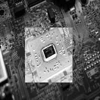
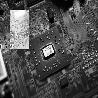
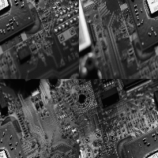

## Manipulação de imagens

Uma das tarefas mais básicas quando manipulamos imagens é aplicar uma certa operação à uma subseção de uma imagem. Nós podemos querer modificar uma certa porção da imagem para que ela fique destacada ou aplicar um efeito especial para uma região especificada. A biblioteca do OpenCV oferece diversas formas para fazer estas operações, as quais espero mostrar em alguns exemplos neste artigo.

Para mostrar estes diferentes tipos de operações, nós faremos um programa simples que modifica uma subseção da imagem para seu negativo.  A wikipedia define uma [imagem negativa](https://en.wikipedia.org/wiki/Negative_(photography)) como:

> Em fotografia, um negativo é uma imagem, usualmente em uma linha ou folha de papel filme transparente, onde as partes mais claras do objeto fotografado aparecem escuras e as áreas escuras aparecem claras.

Então o programa precisa pegar a imagem e modificar suas seções claras para escura e vice versa. Nós vamos pedir ao usuário que especifique dois pontos na imagem que definem os cantos superior esquerdo e inferior direito de uma seção retangular onde nós iremos aplicar a operação. Para simplificar o trabalho, nós vamos redimensionar a imagem para que tenha 200 pixels de largura e altura, permitindo que possamos checar por acessos inválidos ao array.

### O modo ingênuo

Se você pensar em uma imagem como um array 2D, a primeira forma que vem a mente de manipular a imagem é utilizar dois loops *for* e modificar os pixels um por um. OpenCV oferece duas funções para acessar os pixels de uma imagem:

- [Mat::at(x, y)](https://docs.opencv.org/4.4.0/d3/d63/classcv_1_1Mat.html#ac40425b84f60b39fd35e03814122661f) - Retorna uma referência para o valor na linha x e coluna y 
- [Mat::ptr(x, y)](https://docs.opencv.org/4.4.0/d3/d63/classcv_1_1Mat.html#abda2b96aa438a808b43425040a7da81a) - Retorna um ponteiro para o valor na linha x e coluna y. 

Essas funções possuam várias redefinições para que possamos retornar o tipo correto do ponteiro para os diferentes tipos de dados que cv::Mat suporta. Se você não especificar o tipo, um ponteiro simples para `unsigned char` será retornado, mesmo que este não seja o tipo que o cv::Mat contêm e nós precisariamos ter mais cuidado ao fazer aritmética com os ponteiros.

Com isso em mente, vamos fazer nossa primeira implementação do programa utilizando uma dessas funções:

```Cpp
#include <iostream>
#include <opencv2/opencv.hpp>
#include <cxxopts.hpp>

struct Config {
	const std::string file_path;              // Caminho da imagem no sistema
	const std::pair<int, int> top_left;       // coordenadas x & y superior esquerdas
	const std::pair<int, int> lower_right;    // coordenadas x & y inferior direitas 
}

Config parse_cli(int argc, char* argv[]) { /* parse cli */ }

/*
 * forma ingênua de resolver o problema
 */
int main(int argc, char* argv[]) {
    auto config = parse_cli(argc, argv);

    cv::Mat image = cv::imread(config.file_path, cv::IMREAD_GRAYSCALE);

    // Redimensionando a imagem para 200x200
    cv::Mat small_image;
    cv::Size size { 200, 200 };
    cv::resize(image, small_image, size);

    // Renomeando porque Point2i possui atributos mais descritivos que std::pair
    cv::Point2i top_left { config.top_left.first, config.top_left.second };
    cv::Point2i lower_right { config.lower_right.first, config.lower_right.second };

    // Iterando pela região
    for (int i = top_left.x; i < lower_right.x; i++) {
        for (int j = top_left.y; j < lower_right.y; j++) {
            uchar *value = small_image.ptr<uchar>(i, j);
            *value = 255 - *value;          // Faz a inversão de 8 bits para obter o negativo 
        }
    }

    cv::imshow("negative", small_image);
    cv::waitKey();
}
```
<br/>

Com essa implementação, nós podemos executar o binário na linha de comando:

```bash{promptUser: edujtm}
./regions chip-grayscale.jpg --tlx 50 --tly 55 --lrx 160 --lry 150
```
<br/>

E obter o resultado esperado:



A parte que nos interessa do código acima são os dois loops for:

```cpp
// Iterate through the region 
for (int i = top_left.x; i < lower_right.x; i++) {
    for (int j = top_left.y; j < lower_right.y; j++) {
        uchar *value = small_image.ptr<uchar>(i, j);
        *value = 255 - *value;          // Faz a inversão de 8 bits para obter o negativo
    }
}
```
<br/>

Nesse código estamos pedindo ao OpenCV que calcule o deslocamento do início do array de dados onde nosso pixel está localizado, então salvamos o resultado de 255 menos o valor naquela posição. O problema com esta implementação é que, para calcular o deslocamento, nós precisamos fazer uma multiplicação para encontrar a linha e então um soma para encontrar o local do pixel, repetindo este processo **para todos os pixels** da região. Essa [resposta do stackoverflow](https://stackoverflow.com/a/25224916/8310836) explica este problema e mostra uma forma de resolvê-lo.


### Utilizando operadores ROI

Já que estamos aplicando a mesma operação em todos os pixels de dentro da região, nós podemos então utilizar uma operação de broadcasting dentro da região de interesse, o que irá fazer com que nosso código fique mais curto e mais legível.

O OpenCV sobrecarrega o [Mat::operator()](https://docs.opencv.org/4.4.0/d3/d63/classcv_1_1Mat.html#ad543b6bd296ae1247032c750af4718e1) para que possamos extrair subregiões da imagem. Essa subseção extraída não é uma cópia dos valores, apenas uma cópia do cabeçalho que aponta para o mesmo array de dados. Dessa forma, operações na submatriz extraída serão refletidas na imagem original.

```Cpp
/*
 * ROI e broadcasting.
 */
int main(int argc, char* argv[]) {
    auto config = parse_cli(argc, argv);

    cv::Mat image = cv::imread(config.file_path, cv::IMREAD_GRAYSCALE);

    // Redimensionando a imagem para 200x200
    cv::Mat small_image;
    cv::Size size { 200, 200 };
    cv::resize(image, small_image, size);

    // Renomeando porque Point2i possui atributos mais descritivos que std::pair
    cv::Point2i top_left { config.top_left.first, config.top_left.second };
    cv::Point2i lower_right { config.lower_right.first, config.lower_right.second };

    // Uma forma melhorada utilizando regiões de interesse (ROI)
    int height = lower_right.x - top_left.x;
    int width = lower_right.y - top_left.y;
    cv::Rect roi { top_left.x, top_left.y, width, height };

    // Obtem uma view da seção onde iremos fazer a operação
    cv::Mat image_roi = small_image(roi);
    // Aplica a operação de broadcasting
    image_roi = 255 - image_roi;

    cv::imshow("negative", small_image);
    cv::waitKey();
}
```
<br/>

Se nós executarmos o binário com essa implementação:

```bash{promptUser: edujtm}
./regions chip-grayscale.jpg --tlx 20 --tly 20 --lrx 100 --lry 60
```
<br/>

Nós obtemos o resultado desejado novamente:



### Utilizando operadores bit a bit

Já que uma imagem em tons de cinza com um único canal é representada por valores de 8 bits, nós podemos utilizar operadores bitwise para inverter a imagem. Se nós invertemos os bits de cada pixel, obteremos o mesmo valor que ao subtrair a intensidade de 255.

- 0 (0b0000\_0000) -> 255 (0b1111\_1111)
- 1 (0b0000\_0001) -> 254 (0b1111\_1110)
- 2 (0b0000\_0010) -> 253 (0b1111\_1101)

E assim por diante...

Com isso em mente, nós podemos reescrever nossa operação utilizando a função [cv::bitwise\_not()](https://docs.opencv.org/4.4.0/d2/de8/group__core__array.html#ga0002cf8b418479f4cb49a75442baee2f)

```Cpp
/*
 * ROI e operação bitwise
 */
int main(int argc, char* argv[]) {
    auto config = parse_cli(argc, argv);

    cv::Mat image = cv::imread(config.file_path, cv::IMREAD_GRAYSCALE);

    // Redimensionando a imagem para 200x200
    cv::Mat small_image;
    cv::Size size { 200, 200 };
    cv::resize(image, small_image, size);

    // Renomeando porque Point2i possui atributos mais descritivos que std::pair
    cv::Point2i top_left { config.top_left.first, config.top_left.second };
    cv::Point2i lower_right { config.lower_right.first, config.lower_right.second };

    // Criando a região de interesse
    int height = lower_right.x - top_left.x;
    int width = lower_right.y - top_left.y;
    cv::Rect roi { top_left.x, top_left.y, width, height };

    // Obtem uma view da seção onde iremos fazer a operação
    cv::Mat image_roi = small_image(roi);
    // Aplica a operação de bitwise_not
    cv::bitwise_not(image_roi, image_roi);

    cv::imshow("negative", small_image);
    cv::waitKey();
}
```
<br/>

Ao executar o binário resultante, você irá obter os mesmos resultados de antes.

### Comparação de performance

A última questão sobrando é se esta refatoração vale a pena em termos de performance. Se o ganho de performance ao utilizar o operador bit a bit não for razoável, nós podemos optar pelo uso de uma implementação mais simples.

Para testar a performance dos três scripts, eu usei a [imagem original](https://unsplash.com/photos/vruAZdZzQR0) que possui um tamanho de 3632 x 5456 pixels e removi as restrições das dimensões da imagem serem 200 x 200. Após isso, eu cobri as chamadas das operações com chamadas para [std::chrono](https://cplusplus.com/reference/chrono/) e executei o script para inverter uma subregião de 1000 x 1000 pixels.


```Cpp
    auto begin = std::chrono::steady_clock::now();

    // A better way using region of interest 
    int height = lower_right.x - top_left.x;
    int width = lower_right.y - top_left.y;
    cv::Rect roi { top_left.x, top_left.y, width, height };

    // Obtains a view of the section in which we're going to make the operation;
    cv::Mat image_roi = image(roi);
    // Applies a broadcasting operation
    cv::bitwise_not(image_roi, image_roi);

    auto end = std::chrono::steady_clock::now();

    std::cout << "Time elapsed (roi-bitwise): " << 
          std::chrono::duration_cast<std::chrono::microseconds>(end - begin).count() 
          << "[us]" << std::endl;
```
<br />

Estes foram os resultados obtidos:

|Script | Tempo decorrido (g++ -O2) |
| ---- | ---- | ---- |
| for-loop |  1308 (+/- 77) [&#181s] |
| roi-broadcasting | 67 (+/- 44) [&#181s] |
| roi-bitwise | 45 (+/- 46) [&#181s] |

Eu executei os scripts diversas vezes e o tempo de execução flutua ao redor desses valores. Como podemos ver a versão com loop for é um ordem de magnitude mais lenta e nós devemos evitar usá-la caso haja uma melhor opção disponível.

### Um último exemplo de operadores ROI

Outro exemplo onde operadores de região de interesse podem ser úteis se dá ao criar um deslocamento de quadrantes de uma imagem, onde você troca o quadrante superior esquerdo com o inferior direito e o quadrante superior direito com o inferior esquerdo. Um exemplo disso é mostrado abaixo:



A primeira vista, pode parecer que nós precisariamos iterar por metade da imagem, calculando a nova posição para cada pixel e por fim trocá-los de posição, mas esse resultado pode ser alcançado de forma mais simples utilizando uma região de interesse para cada quadrante da imagem, copiando os valores entre eles. A implementação é dada abaixo:

```Cpp
int main(int argc, char* argv[]) {
    auto file_path = parse_cli(argc, argv); 

    // Lê a imagem
    cv::Mat image = cv::imread(file_path, cv::IMREAD_GRAYSCALE);

    cv::Mat squared_image;
    cv::Size size { 200, 200 };
    cv::resize(image, squared_image, size);
    image = squared_image;

    cv::imshow("before", image);

    // Quadrantes
    cv::Rect top_left { 0, 0, image.rows / 2, image.cols / 2 };
    cv::Rect lower_left { image.rows / 2, 0, image.rows / 2, image.cols / 2 };
    cv::Rect top_right { 0, image.cols / 2, image.rows / 2, image.cols / 2 };
    cv::Rect lower_right { image.rows / 2, image.cols / 2, image.rows / 2, image.cols / 2 };

    // Deslocando quadrantes
    cv::Mat temp = cv::Mat::zeros(image.rows / 2, image.cols / 2, CV_8UC1);

    // trocando superior esquerdo com inferior direito
    auto top_left_view = image(top_left);
    auto lower_right_view = image(lower_right);

    top_left_view.copyTo(temp);
    lower_right_view.copyTo(top_left_view);
    temp.copyTo(lower_right_view);
    
		// Trocando superior direito com inferior esquerdo
    auto top_right_view = image(top_right);
    auto lower_left_view = image(lower_left);

    top_right_view.copyTo(temp);
    lower_left_view.copyTo(top_right_view);
    temp.copyTo(lower_left_view);

    cv::imshow("after shifting", image);
    cv::waitKey();
}
```
<br/>

Após algumas cópias de dados, nós obtemos a troca de quadrantes desejada. Isto é muito mais legivel do que calcular uma nova posição para cada pixel em um loop for.

O problema com essa implementação é que ela assume que a altura e largura da imagem são divisiveis por 2. Uma implementação mais robusta checaria o tamanho da imagem e trataria o erro de forma correta.
