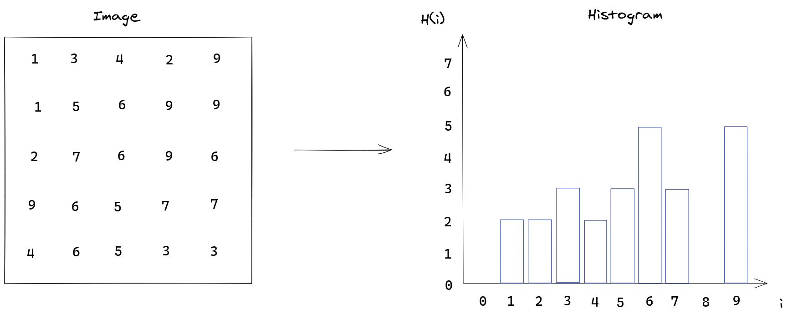
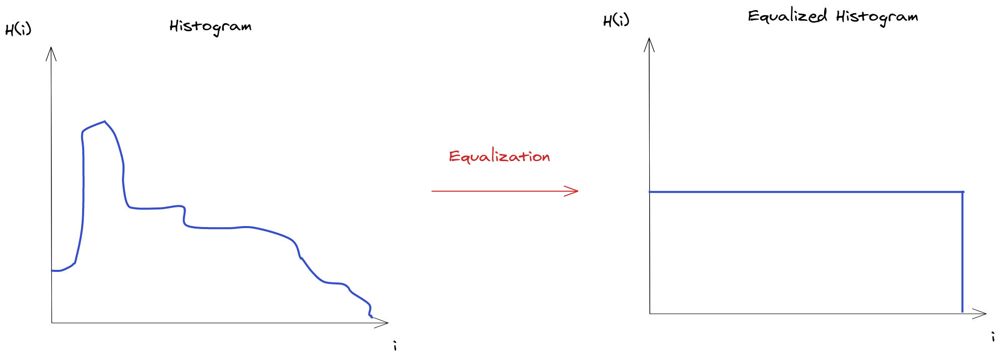
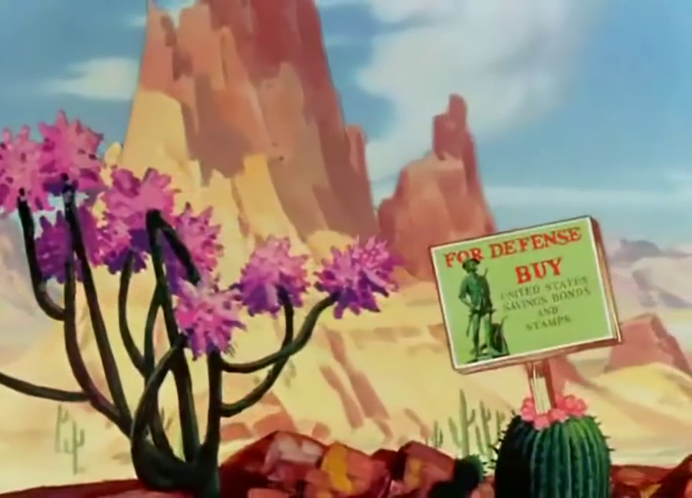
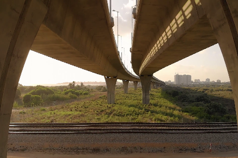

Suponha que seu chefe peça para que você implemente um detector de movimentos para sua empresa, mas você nunca fez isso anteriormente e ele te deu uma prazo para conclusão bem curto. A primeira vista, parece que detectar movimentos em uma imagem pode ser uma tarefa difícil: Como nós podemos definir o que é um movimento em um grupo de pixels se não temos nenhuma informação do relacionamento entre eles? Se nós tentarmos processar pixels individualmente para checar se eles mudaram suas posições, isto com certeza irá gerar umas dores de cabeça.

Você então busca na internet por outras soluções e encontra que as técnicas de processamento de imagem atuais permitem o uso de vários métodos de detecção de movimentos em um video utilizando técnicas de segmentação para separar objetos em primeiro plano do fundo da imagem. Essas técnicas muitas vezes utilizam truques matemáticos complexos que podem ser difíceis de entender para um iniciante, então nós devemos buscar por uma implementação mais simples que, embora não seja tão robusta, ainda dá conta do trabalho.

Felizmente há uma forma mais simples de fazer isso se pensarmos sobre as propriedades da imagem por completo ao invés de seus componentes. Se nós assumirmos que um objeto em movimento irá introduzir novos pixels na imagem, ou do fundo atrás do objeto, ou do própio objeto ao entrar no quadro, nós podemos usar a alteração nas quantidades de cada intensidade dos pixels por toda a imagem para determinar se há movimento. A representação da frequência de dados em uma amostra é dada pelo histograma. Já que trabalhar com histogramas é bem útil em visão computacional, OpenCV oferece um conjunto de ferramentos para criar e manipular esse tipo de representação de dados.

## Entendendo histogramas no OpenCV

Antes de implementarmos nosso detector de moviments, nós precisamos entender o que é um histograma e como trabalhar com eles no OpenCV. Quando se trata de imagens, o histograma é uma representação das frequências de todas as intensidades de seus pixels. Isto é feito ao separar a faixa de valores das intensidades em partições e contando todos os pixels cuja intensidade esteja dentro dos limites da partição. No caso mais simples, onde o número de partições é o mesmo que a quantidade de valores na faixa de intensidades, nós obtemos um histograma como esse:



Mas o número de partições não precisa ser idêntico à quantidade de valores na faixa de intensidades e o tamanho de cada partição não é necessariamente uniforme. No imagem anterior, nós poderiamos agrupar os valores em 5 partições ao invés de 10, o que nós iria dar as faixas: \[0, 2\), \[2, 4\), \[4, 6\),  \[6, 8\), \[8, 10\).

A função que o OpenCV nos dá para obter um histograma de uma imagem é [cv::calcHist()](https://docs.opencv.org/4.4.0/d6/dc7/group__imgproc__hist.html#ga4b2b5fd75503ff9e6844cc4dcdaed35d) e ela possua uma API razoavelmente complicada devido à tentativa de fornecer uma função genérica que se adapta a uma ou várias imagens com quantidades diferentes de canais e partições de intensidades não-uniformes ou uniformes. Nós iremos utilizá-la para uma única imagem de cada vez, então nós precisamos adaptar esta imagem para o que é esperado pela API (i.e. um vetor de imagens).

```Cpp
cv::calcHist(
	const cv::Mat* images,      // Array de imagens estilo C  
	int nimages,                // Números de imagens no array images 
	const int* nchannels,       // Número de canais em cada imagem 
	InputArray mask,            // Quais pixels serão levados em consideração 
	OutputArray hist,           // O histograma resultante da imagem 
	int dims,                   // O número de dimensões do histograma
	const int* histSize,        // A quantidade de partições para cada dimensão
	const float** ranges,       // O tamanho de cada partição 
	bool uniform = true,        // As partições são uniformes? (mesmo tamanho)
	bool accumulate = false     // Se for true, o histograma não será limpo antes da operação
)
```
<br/>

Tem bastante conteúdo para absorver nessa API, então vamos discutir os parâmetros um por um:

- **image** - O array com as imagens cujo histograma será calculado. As imagens devem ser do tipo inteiro 8 bits ou ponto flutuante de 32 bits. Todas as imagens devem ter as mesmas dimensões mas a variação no número de canais é permitida

- **nimages** - Número de imagens no array **image**. Já que os arrays estilo C não possuem informação sobre seu tamanho, é necessário informá-lo por meio da API.

- **nchannels** - Os canais de interesse na imagem. Os canais são enumerados como se eles estivessem planificados (flattened) em um únicod array com todos os canais da image, logo se nós estamos interessados no primeiro e segunda canal da primeira imagem e no segundo canal da segunda imagem, nós necessitariamos de um vetor **nchannels** = { 0, 1, 4 }. Um ponteiro nulo *nullptr* pode ser passado caso uma unica imagem com um único canal será processada.

- **mask** - Uma máscara com elementos de 8 bits que seleciona quais pixels serão levados em consideração. Apenas pixels da imagem cujo pixel correspondente na máscara é não-nulo serão contados. Se nós desejamos contar todos os pixels da imagem, `cv::noArray()` pode ser utilizado.

- **hist** - O histograma resultante para todas as imagens.

- **dims** - O número de dimensões do histograma. A função consegue lidar com dados com alta dimensionalidade caso queiramos agrupá-los em partições de várias dimensões. Por exemplo, se nós tivessemos uma imagem RGB em que queremos ver a frequência dos valores com uma determinada cor azul e vermelha, nós precisariamos de um histograma de 2 dimensões onde `hist.at<float>(i,j)` nos daria a frequência dos pixels com **intensidade vermelha = i** e **intensidade azul = j**.

- **histSize** - Define a quantidade de partições utilizada em cada dimensão do histograma.

- **ranges** - A faixa de valores do histograma. Esse parâmetro é utilizado para determinar a faixa de valores que serão alocadas em cada partição. A interpretação desse valor depende do valor do parâmetros **uniform**: Se o histograma é uniforme (**uniform = true**), é necessário apenas definir o valor máximo e mínimo da faixa, que será dividido uniformemente pela quantidade de partições. Se o histograma não for uniforme (**uniforma = false**), é preciso então definir as faixas de todas as partições explicitamente, ou seja, é necessário declarar um array com **histSize[i] + 1** elementos.

- **uniform** - Se o histograma for uniforme todas as partições terão o mesmo tamanho.

- **accumulate** - Se os valores que já estão em **hist** serão substituídos ou não durante a operação.
 Definir **accumulate** como true permite ao usuário obter um histograma acumulado entre diversas chamadas de `cv::calcHist()` dado que a mesma variável seja fornecida para o parâmetro **hist**.

Já que o parâmetro **ranges** é razoavelmente complicado, ele merece um pouco mais de explicação. Vamos ver alguns exemplos de como nós podemos especificar faixas para o exemplo de histograma mostrado na imagem anterior que possui uma faixa de intensidades entre [0, 10).

Se nós queremos que nossas partições sejam uniformes com 2 elementos cada, nós podemos definir a configuraçãos como:

```Cpp
int *histSize = { 5 };
float *ranges[] = {
	{0, 10}
};
int dims = 1;
bool uniform = true;
```
<br/>

Isso irá dividir a faixa de valores [0, 10) e dividi-la igualemente em 5 partições.

Se nós quisermos separar as intensidades em 4 partições não uniformes com faixas [0, 2), [2,5), [5, 8) and [8, 10), devemos especificar os parâmetros dessa forma:

```Cpp
int *histSize = { 4 };
float *ranges[] = {
	{0, 2, 5, 8, 10}
};
int dims = 1;
bool uniform = false;
```
<br/>

Onde é possível notar que a faixa de valores para a partição *i* é dado pelos valores de *ranges[i]* e *ranges[i+1]*. Além disso precisamos especificar histSize[i] + 1 elementos para definir o histograma.

Se nós tivermos uma imagem no espaço de cor HSV onde cada canal possui uma faixa de valores diferente, nós precisaremos definir um array diferente para cada canal.

```Cpp
int *histSize = { 60, 20, 20 };
float *ranges[] = {
	{ 0, 360 },   // Faixa de valores para o canal de matiz (hue)
	{ 0, 100 },   // Faixa de valores para o canal de saturação  (saturation)
	{ 0, 100 },   // Faixa de valores para o canal de valor (value) 
};
int dims = 3;
bool uniform = true;
```
<br/>

Estes parâmetros iriam resultar em um histograma tridimensional com o canal de matiz dividido em 60 partições e os canais de saturação e valor teriam ambos 20 partições.

É importante notar que o array **images** não é utilizado para gerar histogramas para várias imagens de uma única vez, é apenas um mecanismo de seleção de canais: nós podemos passar duas imagens com um único canal em tons de cinza e selecionar ambos os canais com **nchannels**, mas isso não irá gerar dois histogramas separados, ao invés disso a função irá gerar um histograma único com duas dimensões onde cada partição é um membro do produto cartesiano entre as partições da primeira e segunda imagem, ou seja, haverá uma partição para cada conjunto (i, j), onde i é um valor de intensidade pertencente a primeira imagem, e j é um valor de intensidade pertencente a segunda.

## Utilizando histogramas em processamento de imagens: equalização de histogramas

Agora que nós temos uma ideia básica de como criar histogramas no OpenCV, vamos ver como nós podemos utilizá-los em prática. Um dos efeitos mais simples que nós podemos obter utilizando a manipulação de histogramas é melhorar o constraste da imagem atráves de equalização de histograma. Essa técnica busca mapear as intensidades dos pixels de uma imagem de forma que o histograma resultante possua uma distribuição uniforme sobre toda a faixa de valores de intensidade. Esse processo é ilustrado abaixo:



Se o histograma fosse contínuo, a equalização levaria à uma distribuição resultante perfeitamente uniforme, mas como os histogramas obtidos de imagens são discretos, a equalização resulta em uma aproximação da distribuição uniforme.

A equalização discreta do histograma é definida pela seguinte equação:

$$
  out_{k} = \frac{L-1}{MN}\sum_{j=0}^{k}hist[j] 
$$

$$
  k = 0, 1, 2, 3, ... L - 1
$$

Onde um pixel de intensidade $k$ na imagem de origem seria mapeado para uma intensidade $out_{k}$, $M$ e $N$ são as dimensões da imagem e $L$ é o valor máximo da faixa de intensidades. Já que o resultado pode ser um valor fracionário, as intensidades são arredondadas para o inteiro mais próximo.

Ao espalhar as intensidades dos pixels sobre toda a faixa de intensidades, os pixels são mapeados de forma que o contraste entre padrões da imagem é melhorado. Isto pode ser utilizado para recuperar detalhes em uma imagem desbotada, por exemplo

Esta operação é implementada por meio da função [cv::equalizeHist()](https://docs.opencv.org/4.4.0/d6/dc7/group__imgproc__hist.html#ga7e54091f0c937d49bf84152a16f76d6e) do OpenCV. Vamos ver como podemos usá-la para processar um stream de vídeo.

### Obtendo o stream de video

O stream de video pode ser obtido utilizando a classe [cv::VideoCapture](https://docs.opencv.org/4.4.0/d8/dfe/classcv_1_1VideoCapture.html). Ela funciona tanto para videos gravados ao especificar o caminho no sistema de arquivo onde eles estão armazenados, como para o feed de uma câmera em tempo real ao especificar seu ID.

```Cpp
struct Config {
    const std::string file_path;
    const unsigned int screen_width;
    const unsigned int screen_height;
}

Config parse_cli(int argc, char* argv[]) {
   /* processar paramertos da linha de comando */
}

int main(int argc, char* argv[]) {
    auto config = parse_cli(argc, argv);
    cv::VideoCapture cap;
    if (config.file_path.empty()) {
        cap.open(0);
    } else {
        cap.open(config.file_path);
    }

    if (!cap.isOpened()) {
        std::cout << "Não foi possivel abrir a câmera/video." << std::endl;
        return -1;
    }

    // Define o tamanho do quadro a ser capturado
    cap.set(cv::CAP_PROP_FRAME_WIDTH, config.screen_width);
    cap.set(cv::CAP_PROP_FRAME_HEIGHT, config.screen_height);

    // Os valores de altura e largura podem não estar disponíveis
    int width = cap.get(cv::CAP_PROP_FRAME_WIDTH);
    int height = cap.get(cv::CAP_PROP_FRAME_HEIGHT);
}
```
<br/>

Nós precisamos especificar a altura e a largura dos quadros do video, mas nem todos os tamanhos são suportados, então nós precisamos checar também qual o valor que foi realmente selecionado.

### Lendo quadros

Agora nós precisamos ler os quadros do video e aplicar a equalização de histograma em cada um.

```Cpp
int main() {
    /* Obtendo o stream de video */

    cv::Mat image;
    while (1) {
        cap >> image;
        if (image.empty()) {
            std::cerr << "Nao foi possivel ler quadros do video." << std::endl;
            exit(1);
        }

        // --- equalização do histograma ---
        auto equalizedImage = equalize_rgb(image); 
        auto equalizedLabImage = equalize_cie_lab(image);

        cv::imshow("image", image);
        cv::imshow("equalized rgb", equalizedImage);
        cv::imshow("equalized cie lab", equalizedLabImage);
        int key = cv::waitKey(30);
        if (key == ESCAPE_KEY)
            break;
    }
}
```
<br/>

Duas equalizações diferentes estão sendo aplicadas aqui, uma diretamente nos canais RGB da imagem e outra que primeiramente modifica a imagem do espaço RGB para o espaço CIE Lab e só então aplica a equalização.

É necessário apenas fazer uma única equalização, nós fizemos duas equalizações diferentes aqui para que possamos comparar o efeito de cada uma na imagem original.

### Definindo a equalização

A equalização do histograma de uma imagem RGB é feita por meio da equalização de cada canal individualmente, isso pode gerar artefatos visuais indesejados na imagem: já que a informação de cor em uma imagem RGB é completa apenas quando os três canais são combinados, equalizar os canais individualmente pode introduzir novas cores na imagem devido aos mapeamentos diferentes que ocorrem em cada canal. Uma equalização correta teria que mapear os três canais de forma idêntica.

Já que o que nós queremos é aumentar o constrate de intensidade da imagem ao invés de manipular suas cores, nós podemos modificar a representação para um espaço de cor onde a intensidade é expressada separadamente.

```Cpp
/*
 * Equalização feita em canais individuais RGB
 */
cv::Mat equalize_rgb(cv::Mat image) {
    std::vector<cv::Mat> planes;
    cv::split(image, planes);

    std::vector<cv::Mat> equalizedChannels(3, cv::Mat());
    cv::equalizeHist(planes[0], equalizedChannels[0]); 
    cv::equalizeHist(planes[1], equalizedChannels[1]); 
    cv::equalizeHist(planes[2], equalizedChannels[2]); 

    cv::Mat equalizedImage;
    cv::merge(equalizedChannels, equalizedImage);
    return equalizedImage;
}

cv::Mat equalize_cie_lab(cv::Mat image) {
    std::vector<cv::Mat> planes;
    std::vector<cv::Mat> result_planes;
    cv::Mat lab_image;

    cv::cvtColor(image, lab_image, cv::COLOR_RGB2Lab);
    cv::split(lab_image, planes);

    cv::Mat equalizedLuminosity;
    cv::equalizeHist(planes[0], equalizedLuminosity);
    
    result_planes = {
        equalizedLuminosity,
        planes[1].clone(),
        planes[2].clone(),
    };

    cv::Mat equalizedLabImage, equalizedImage;
    cv::merge(result_planes, equalizedLabImage);
    cv::cvtColor(equalizedLabImage, equalizedImage, cv::COLOR_Lab2RGB);
    return equalizedImage;
}

int main(int argc, char* argv[]) {
    /* Obter o stream de video */
    /* Ler os quadros */
}
```
<br/>

O [espaço de cor CIE Lab](https://en.wikipedia.org/wiki/CIELAB_color_space) possui um canal separado que representa a intensidade da luz, nós podemos então aplicar a equalização nesse único canal e então converter a imagem de volta para RGB.

Com isso, nós podemos executar o binário e observar os resultados:

```bash{promptUser: edujtm}{outputLines: 2}
./build/equal_hist -i ~/Videos/the-wacky-wabbit.mp4
```
<br/>

Com o frame não equalizado sendo:



Nós temos a seguinte equalização RGB resultante:


Nesse caso, a equalização RGB está aceitável, mas ainda é possível notar que ela introduziu bordas rosas nas montanhas. Em outros frames a variação de cor resultante é bastante perceptível.

Por fim, a equalização CIE Lab resultante:


Nós podemos notar que a equalização fez com que a imagem original se tornasse mais escura e o constraste entre os cactus e nuvens são mais aparentes.

## Implementando o detector de movimentos

Depois de falar sobre histogramas por um bom tempo, nós podemos finalmente iniciar o desenvolvimento donosso detector de movimentos. A ideia por trás da implementação de um detector de movimentos utilizando histogramas envolve a comparação dos histrogramas de frames subsequentes, checando se o movimento do objeto introduziu mudanças na frequência das intensidades.

Nosso detector de movimentos irá mostrar um texto de alarme na tela caso ele detecte qualquer objeto em movimento para que possamos checar se está funcionando corretamente.

Para implementar a comparação de histogramas, nós precisamos armazenar tanto o frame atual quanto o anterior para que possamos compará-los. Eu decidi utilizar um std::deque para isso pois eu acredito que o problema se encaixa bem na ideia de janelas móveis, mas deve haver uma implementação mais simples que apenas armazena o frame anterior.

Baseado nisso, nós chegamos na seguinte implementação:

```Cpp
/**
 * Calcula um escore de similaridade entre dois histogramas subsequentes
 */
class HistogramSimilarity {
    std::deque<cv::Mat> window {};
    float _score = 1.0;             // 1.0 é o escore para histogramas idênticos 

    public:
        void push(cv::Mat current_histogram) {
            // Se há apenas um unico frame, nós armazenamos o atual
            // e calculamos o escore de similaridade
            if (window.size() == 1) {
                auto previous = window.back();
                this->_score = this->calc_score(previous, current_histogram);

            // Se houverem dois frames, nós descartamos o
            // mais antigo para dar espaço para o atual
            } else if (window.size() > 1) {
                window.pop_back();
                auto previous = window.back();
                this->_score = this->calc_score(previous, current_histogram);
            }

            // Se não houver nenhum frame armazenado, nós não podemos
            // calcular o escore ainda
            window.push_front(current_histogram);
        }

        float score() {
            return this->_score;
        }

    private:
        float calc_score(cv::Mat hist1, cv::Mat hist2) {
            return cv::compareHist(hist1, hist2, cv::HISTCMP_CORREL);
        }
};
```
<br/>

Nós temos um único método push que receberá os frames e calculará os escores por demanda. Existem três estados possíveis para a nossa janela móvel:

- A janela está vazia, o que significa que nenhum frame foi consumido ainda. Nós não podemos calcular a similaridade, então nós apenas armazenamos o frame atual e esperamos pelo próximo.

- A janela possui um frame. Nesse caso nós calculamos a similaridade e armazenamos o frame atual para a próxima operação.

- A janela possui dois frames. Nesse caso, nós descartamos o frame mais antigo, calculamos o escore e armazenamos o frame atual.

O escore é implementado por meio da função [cv::compareHist()](https://docs.opencv.org/4.4.0/d6/dc7/group__imgproc__hist.html#gaf4190090efa5c47cb367cf97a9a519bd) utilizando o metodo de comparação `cv::HISTCOMP_CORREL` que calcula a [correlação estatística](https://en.wikipedia.org/wiki/Correlation_and_dependence) entre os histogramas. Utilizando este método de comparação, a ausência de movimento seria representada por um escore igual a 1.0, enquanto um movimento iria levar o escore em direção a -1.0 dependendo do quão grande foi a variação introduzida na imagem.

Com isso, nós temos um escore que nos permite implementar o detector de movimento ao checar se ele é maior que um limiar:

```Cpp
/**
 * Detecta movimentos baseado na similaridade entre
 * histogramas subsequente em um stream de imagens (camera ou video)
 */
class MotionDetector {
    HistogramSimilarity similarity;
    float threshold;
    const unsigned int alarm_frame_qnt;
    unsigned int alarm_frame_count;

    public:
        MotionDetector(float thres, unsigned int alarm_frame_quantity) :
            similarity {},
            threshold { thres },
            alarm_frame_qnt { alarm_frame_quantity },
            alarm_frame_count { 0 } {}

        void push(cv::Mat histogram) {
            if (alarm_active()) {
                alarm_frame_count--;
            }

            similarity.push(histogram);

            if (motion_detected() && !alarm_active()) {
                alarm_frame_count = alarm_frame_qnt;
            }
        }

        float score() {
            return similarity.score();
        }

        bool motion_detected() {
            return similarity.score() < threshold;
        }

        float alarm_counter() {
            return alarm_frame_count;
        }

        bool alarm_active() {
            return alarm_frame_count != 0;
        }
};
```
<br/>

O detector de movimentos delega os frames para a classe `HistogramSimilarity` e checa se o escore resultante é maior que o limiar. Se nós tentarmos mostrar o alarme na tela, ele será apagado assim que o próximo frame for desenhado. Isto acontece tão rápido que talvez nem seja possível observar o alerta na tela, então nós criamos um contador de frames que irá definir por quantos frames o texto de alarme será mostrado.

Por fim, nós colocamos isso em prática ao abrir um arquivo de video e lendo seu conteúdo. Nós podemos obter o stream de video da mesma forma que fizemos para o [exemplo de equalização](#obtendo-o-stream-de-video).

```Cpp
struct Config {
    const std::string file_path;
    const unsigned int screen_width;
    const unsigned int screen_height;
    const float threshold;
    const unsigned int alarm_qnt_frame;
};

Config parse_cli(int argc, char* argv[]) {/* parse cli arguments */}

int main(int argc, char* argv[]) {
    auto config = parse_cli(argc, argv);
    /* Obter o stream de video */

    // ----- Configurando o stream de video -----

    // Histograma para um dos canais da imagem
    cv::Mat histR;
    // Quantidade de partições on as intensidades dos pixels serão alocadas
    int nbins = 64;
    // Os limites da faixa de valores do histograma
    float range[] = { 0, 256 };
    const float *histrange = { range };
    // As partições do histograma são uniformes
    bool uniform = true;
    // Acumular o resultado com os valores atuais do histograma
    bool accumulate = false;

    // Armazena os canais BGR separados (i.e. planes[] é o canal vermelho)
    std::vector<cv::Mat> planes;

    cv::Mat resized_image;
    cv::Point screen_size { config.screen_width, config.screen_height };

    MotionDetector detector(config.threshold, config.alarm_qnt_frame);
    while (1) {
        cap >> image;
        if (image.empty()) {
            std::cerr << "Could not read frame from video, possibly due to wrong screen dimensions." << std::endl;
            exit(1);
        }

        cv::resize(image, resized_image, screen_size);
        //  Divide os canais individuais da imagem
        cv::split(resized_image, planes);
        auto blue_channel = planes[0];

        // Obtem o histograma do canal azul
        cv::calcHist(
            &blue_channel,
            1,
            nullptr,
            cv::noArray(),
            histB,
            1,
            &nbins,
            &histrange,
            uniform, 
            accumulate
        );

        // Nós passamos o histograma para o detector
        detector.push(histB.clone());

        // Se o alarme está ativo, escrevemos uma mensagem na tela
        if (detector.alarm_active()) {
            cv::Point2i top_left { resized_image.rows / 20 , resized_image.cols / 20 };
            cv::putText(
                resized_image,
                "Motion Detected",
                top_left,
                cv::FONT_HERSHEY_PLAIN,
                1.2,
                CV_RGB(255, 0, 0)
            ); 
        }

        cv::imshow("image", resized_image);
        int key = cv::waitKey(30);
        if (key == ESCAPE_KEY)
            break;
    }

    return 0;
}
```
<br/>

Eu testei esta implementação nesse [video do pexels](https://www.pexels.com/video/a-railway-under-a-flyover-3250590/) que mostra um trem se movendo embaixo de uma ponte. Com a escolha apropiada do limiar de detecção, o detector conseguiu detectar o trem se movendo razoavelmente bem.

```bash{promptUser: edujtm}{outputLines: 2}
./build/apps/motion_detector -i ~/Videos/train-bridge.mp4  --width 480 --height 320 -t 0.9972
```
<br/>

Alguns exemplos do detector de movimentos podem ser vistos abaixo:



O detector é capaz de ver o trem atravessando os trilhos:


*Creditos: imagens obtidas desse [video](https://www.pexels.com/video/a-railway-under-a-flyover-3250590/) filmado por [Alexander Bobrov](https://www.pexels.com/@alexander-bobrov-390088?utm_content=attributionCopyText&utm_medium=referral&utm_source=pexels), disponível no [Pexels](https://www.pexels.com/)*

Já que esse detector não é robusto, ele pode gerar detecções espúrias que provavelmente não são aceitáveis quando estamos desenvolvendo um alarme. Além disso, o sensor é bem sensível ao limiar de intensidade especificado: se dermos um valor muito baixo, é possível que o sensor não detecte nenhum movimento e, além disso, pequenos objetos podem não ser detectados já que não causam variações grandes na imagem. Então isto está longe de ser um detector ideal, mas é um bom exemplo de como pensar nas imagens em termos de seus histogramas.

## Conclusão

As vezes pode ser útil pensar nas imagens em termos de seus histogramas, ao invés de um array de pixels. Com o histograma em mãos, nós podemos manipulá-lo e observar seus efeitos na imagem ou usá-lo em combinação com outras técnicas para obter o efeito desejado. OpenCV oferece diversas funções para gerar e manipular histogramas de imagens, espero que este artigo tenha mostrado como elas podem ser utilizadas em prática.
