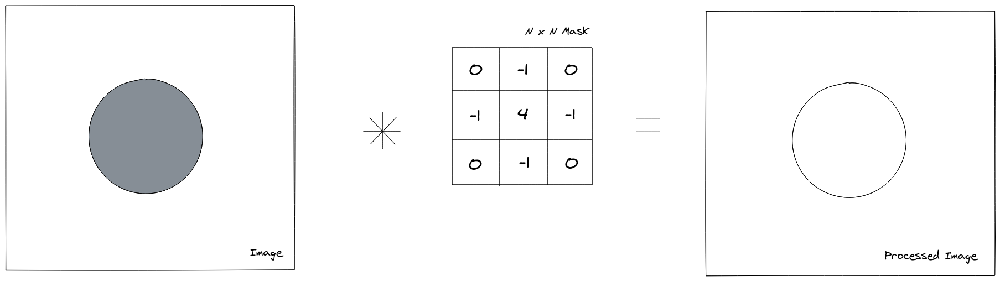
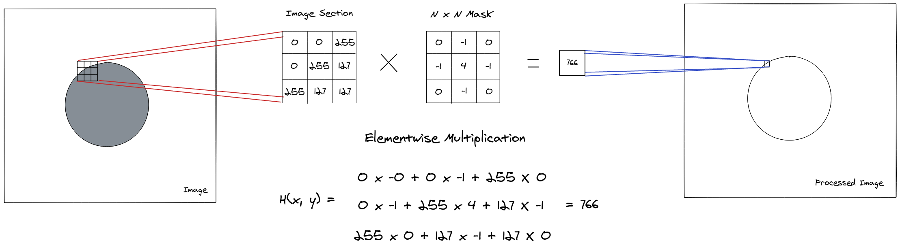
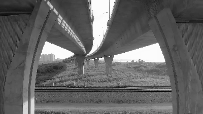
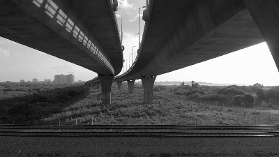
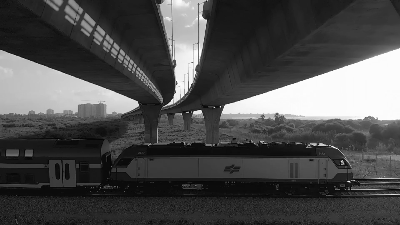
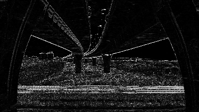
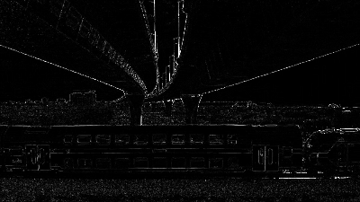

A técnica de filtragem espacial é uma das ferramentas básicas de processamento de imagens, possuindo um conceito simples porém com uma variada gama de aplicações. Este conceito se baseia na ideia de que nós podemos obter mais informações sobre um pixel ao olhar para os seus vizinhos e, baseado nessa informação, aplicar uma operação que irá destacar uma propriedade desejada. Esta ideia, ao ser unida com técnicas de análise estatística, é a base para redes neurais com arquitetura convolucional, onde o filtro adapta-se aos dados utilizados para treinar o modelo de aprendizagem de máquina.

Mesmo que os estudos em aprendizagem de máquina tenham conseguido aplicar as técnicas de filtragem espacial em um largo domínio de problemas, a técnica já era util ainda antes das redes neurais serem popularizadas. Este artigo pretende abordar os conceitos básicos por trás dessa técnica antiga e como ela é aplicada em problemas de processamento de imagem.


## O processo de filtragem espacial 

A operação de filtragem espacial é feita por meio da aplicação de uma máscara em uma imagem para obter uma nova imagem processada. Esta máscara é aplicada em cada pixel da imagem em um processo chamado de [convolução](https://pt.wikipedia.org/wiki/Convolu%C3%A7%C3%A3o). Esse termo deriva do conceito matemático de mesmo nome, que define uma operação onde duas funções deslizam uma sobre a outra e as partes que se sobrepõem são integradas para gerar um novo ponto da função resultante. No caso de processamento de imagens, a convolução se dá por meio do deslizamento da máscara sobre a imagem e, para cada posição do deslizamento, se faz uma multiplicação elemento a elemento entre máscara e a imagem para gerar um novo pixel da imagem resultante.



Isto pode ser interpretado também como uma expansão de uma operação elemento a elemento na imagem: Se você aplicar uma operação em todos os pixels da imagem individualmente (e.g. multiplicar por um escalar), a única informação que você teria é a intensidade do pixel naquele local. Se nós queremos saber se aquele pixel faz parte de uma borda or se é afetado por ruído, isso não é o bastante. É ai que entra máscara, permitindo que a operação tenha informações sobre a vizinhança do pixel.

Em processamento de imagens, esta operação é definida matematicamente pela seguinte equação:

$$
  h(x, y)= \sum_{s=-a}^{a}\sum_{t=-b}^{b} w(s, t) \cdot f(x + s, y+t)
$$

Onde $w$ define a máscara, $f$ é a imagem de entrada e $h(x,y)$ é o pixel resultante. A interpretação gráfica dessa operação pode ser vista na imagem abaixo:



*Perceba que a operação acima resultou em um valor acima do máximo disponível em dados de 8 bits normalmente utilizado para representar imagens, por causa disso, a operação de filtragem é geralmente feita com tipos de dados de precisão mais alta e o resultado é normalizado de volta para a faixa de valores de 8 bits [0, 255]*

A operação na imagem acima precisa ser repetida em todos os pixels da imagem (i.e. a parte de deslizamento da operação). Já que é dificíl transmitir essa ideia utilizando apenas imagens, eu vou delegar a explicação para esta [visualização interativa](https://setosa.io/ev/image-kernels/)\* que mostra o efeito de várias máscaras em uma imagem e permite que você altere seus valores.

Por fim, é importante notar que, embora a maioria das máscaras mostradas aqui possui dimensões 3x3, isto não é uma necessidade: As máscaras podem possuir quaisquer dimensões sejam necessárias, porém maiores dimensões acarretam em maior custo computacional.

\* *Esta visualização/artigo é bem curta e eu realmente recomendo dar uma lida para um melhor entedimento da próxima seção*

## Deduzindo os filtros espaciais básicos

Agora nós temos uma ideia de como a operação de filtragam é feita em uma imagem, porém ainda está faltando uma peça do quebra-cabeça: Como nos definimos quais valores serão utilizados para preencher a máscara?

Os valores utilizados nas máscaras mais comuns não são definidos aleatoriamente, eles são na verdade deduzidos a partir de propriedades matemáticas que, quandos vistas de uma perspectiva de processamento de imagens, terão o efeito desejado na imagem.

### Filtros suavizantes

Filtros suavizantes reduzem a quantidade de variações rápidas de intensidade dentro da imagem, o que faz com que bordas from objetos tenham transições mais suaves entre as intensidades da vizinhança. Eles são utilizados principalmente para esborrar imagens e reduzir ruído.

#### Filtro da média 

Este é um dos filtros mais básicos que simplesmente calcula a média entre as intensidades dos pixels vizinhos, como o nome indica. Ao calcular a média das intensidades em seções da imagem, este filtro permite que o ruído seja atenuado, baseado na assunção de que os pixels vizinhos terão intensidades similares, causando o cancelamento do ruido.

$$
	Mask(x,y) = \frac{1}{M \cdot N}
$$

Aplicando a máscara na definição da operação de filtragem espacial, nós obtemos:

$$
  h(x, y)= \sum_{s=-a}^{a}\sum_{t=-b}^{b} Mask(s, t) \cdot f(x + s, y+t)
$$

$$
  h(x, y) = \frac{1}{M \cdot N} \sum_{s=-a}^{a}\sum_{t=-b}^{b} f(x + s, y+t)
$$

Isto é apenas uma operação de média bidimensional sobre os pixels que estão abaixo da máscara.  Essa máscara pode ser implementada ao repetir a parte constante sobre seus elementos:

```Cpp
float mascara_media[] = {
	1./9, 1./9, 1./9,
	1./9, 1./9, 1./9,
	1./9, 1./9, 1./9
};
```
<br/>


#### Filtro da Mediana 

Outra máscara disponível é o filtro da mediana, que encontra a mediana entre os valores de intensidade dos pixels na vizinhança. Isto permite que figuras que possuem ruído com picos de intensidade sejam melhoradas de forma que esse tipo de ruído é removido quase por completo.

Embora o processo de convolução seja similar com o das outras máscaras (i.e. a máscara desliza sobre a imagem inteira), a operação de mediana não pode ser implementada por meio de uma multiplação elemento a elemento entre a máscara e a imagem, ao invés disso é preciso agrupar os pixels da vizinhança, ordená-los e então obter a mediana da intensidade.

#### Filtro Gaussiano 

Por fim, outro filtro suavizante é o filtro de borramento gaussian que, como o nome indica, aplica uma função gaussiana sobre a imagem. Isso dá mais peso para o pixel no centro da máscara, mas ainda permite que o pixels vizinhos tenham efeito no resultado. Esse tipo de filtro pode manter informações de bordas melhor do que um filtro de média simples, já que pixels da borda terão um peso maior que seus vizinhos, mas ainda causará o borramento da imagem como resultado final.

A definição matemática de uma função gaussiana bidimensional é dada por:

$$
	G(x, y) = \frac{1}{2\pi \sigma^{2}} e^{-\frac{x^{2} + y^{2}}{2\sigma^{2}} }
$$

Nós podemos aproximar a máscara gaussiana utilizando os seguintes valores:

```Cpp
float mascara_gaussiana[] = {
	0.0625, 0.125, 0.0625,
	0.125 , 0.25 , 0.125 ,
	0.0625, 0.125, 0.0625
}
```
<br/>

### Filtros de aguçamento 

Os filtros que acentuam as variações de intensidade entre pixels vizinhos são classificados como filtros de aguçamento. Eles atuam através da aproximação de derivadas de funções de forma que a variação de intensidade seja estimada. Dessa forma, seções da imagem onde a variação de intensidade ocorre de forma rápida, como em bordas de objetos, serão destacadas. A desvantagem do aguçamento se dá pela amplificação do ruído presente na imagem.

#### Filtro laplaciano

O filtro laplaciano é uma aproximação da derivada de segunda ordem em ambas as dimensões da imagem. As derivadas de segunda ordem possuem a propriedade de que seu valor é não nulo apenas quando a primeira derivada está variando, isto faz com que as áreas com intensidade constante e áreas onde a variação de intensidade é nula (i.e. rampas de intensidade), sejam nulas na imagem resultante.

Além disso, já que a derivada de segunda ordem é positiva ou negativa dependendo da alteração na variação de intensidade, se houver uma variação rápida de intensidade para cima ou para baixo, seguida de uma seção com intensidade constante, como acontece em bordas de objetos, haverá na imagem resultante uma inversão de sinal, que pode ser utilizada para detectar estas mudanças.

O laplaciano é definido como:

$$
	laplaciano: \nabla^{2} f = \frac{\partial^{2}{f}}{\partial{x^{2}}} + \frac{\partial^{2}{f}}{\partial{y^{2}}}
$$

As derivadas parciais podem ser aproximadas, usando o [método das diferenças finitas](https://pt.wikipedia.org/wiki/M%C3%A9todo_das_diferen%C3%A7as_finitas), por:

$$
	\frac{\partial^{2}{f}}{\partial{x^{2}}} = f(x+1, y) + f(x-1, y) - 2f(x, y)
$$

$$
	\frac{\partial^{2}{f}}{\partial{y^{2}}} = f(x, y+1) + f(x, y-1) - 2f(x, y)
$$

Por fim, ao substituir estas equações no laplaciano, nós obtemos a aproximação:

$$
	\nabla^{2} f = f(x+1, y)  + f(x-1, y) + f (x, y+1) + f (x, y-1) - 4f(x, y) 
$$

Que nos dá os valores comumente utilizados para implementar a máscara laplaciana:

```Cpp
float mascara_laplaciana[] = {
	0,  1, 0,
	1, -4, 1,
	0,  1, 0
};

// Se as derivadas diagonais também forem levadas em consideração
float outra_mascara_laplaciana[] = {
	1,  1, 1,
	1, -8, 1,
	1,  1, 1
};

// Os negativos das máscaras acima também são utilizados em prática
```
<br/>

#### Filtro de Sobel

Outro filtro baseado em derivada são as máscaras de Sobel que, por sua vez, aproxima a derivada de primeira ordem. Estas máscaras são apropiadas para encontrar bordas que estão em uma direção específica. Dado que a máscara representa uma derivada de primeira ordem, ela irá reagir a qualquer variação de intensidade que aconteça na imagem, enquanto seções constante serão nulas.

Existem duas máscaras de Sobel, uma detecta bordas na direção horizontal, enquanto outra detecta bordas verticais.

As aproximações das derivadas são dadas abaixo:

**Horizontal**
$$
	\frac{\partial f}{\partial x} = f(x+1, y+1) + 2 f(x, y+1) + f(x-1, y+1) 
$$

$$
	- f(x+1, y-1) - 2f(x, y-1) - f(x-1, y-1)
$$

**Vertical**

$$
	\frac{\partial f}{\partial y} = f(x+1, y-1) + 2 f(x+1, y) + f(x+1, y+1) 
$$

$$
	- f(x-1, y-1) - 2f(x-1, 1) - f(x-1, y+1)
$$

Que pode ser implementado como:

```Cpp
float sobel_vertical[] = {
	-1, -2, -1,
	 0,  0,  0,
	 1,  2,  1
};

float sobel_horizontal[] = {
	-1,  0, 1,
	-2,  0, 2,
	-1,  0, 1
};
```
<br/>

#### Filtro do laplaciano de gaussiana

Os filtros anteriors são bons ao detectar bordas, mas já que eles são baseados em aproximações de derivadas, o ruído será amplificado quando a máscara for aplicada na imagem. Para combater este efeito, nós poderiamos aplicar uma operação suavizante antes de fazer o aguçamento. Esta é a ideia por trás do filtro do laplaciano de gaussiana: a gaussiana suaviza a imagem, o que permite então que o laplaciano tenha um melhor efeito ao aguçar bordas.

Esta máscara é deduzida da seguinte forma:

$$
	G(x,y) = e^{- \frac{ x^{2} + y^{2} }{ 2 \sigma^{2}} }
$$

$$
	\nabla^{2} G(x,y) = \frac{\partial^{2}}{\partial x^{2}} G(x,y) + \frac{\partial^{2}}{\partial y^{2}} G(x,y)
$$

Utilizando a regra da cadeia para derivadas:

$$
  \frac{\partial}{\partial x} G(x,y) = - \frac{2x}{2 \sigma^{2}} e^{- \frac{ x^{2} + y^{2} }{ 2 \sigma^{2}} } = - \frac{1}{\sigma^{2}} \cdot x e^{- \frac{ x^{2} + y^{2} }{ 2 \sigma^{2}}}
$$

Agora nós utilizamos a regra do produto de funções para obter a segunda derivada:

$$
  \frac{\partial^2}{\partial x^2} G(x,y) = - \frac{1}{\sigma^{2}} (e^{- \frac{ x^{2} + y^{2} }{ 2 \sigma^{2}}} - x \cdot ( \frac{1}{\sigma^{2}} x e^{- \frac{ x^{2} + y^{2} }{ 2 \sigma^{2}}} ))
$$

$$
  \frac{\partial^2}{\partial x^2} G(x,y) = -\frac{e^{- \frac{ x^{2} + y^{2} }{ 2 \sigma^{2}}}}{\sigma^{2}} + \frac{x^{2} e^{- \frac{ x^{2} + y^{2} }{ 2 \sigma^{2}}}}{\sigma^4}
$$

$$
  \frac{\partial^2}{\partial x^2} G(x,y) = \frac{(x^{2} - \sigma^{2})}{ \sigma^4 } e^{ -\frac{ x^{2} + y^{2} }{ 2 \sigma^{2} } }
$$

Se fizermos o mesmo para a derivada na dimensão $y$, nós obtemos:

$$
  \frac{\partial^2}{\partial y^2} G(x,y) = \frac{(y^{2} - \sigma^{2})}{ \sigma^4 } e^{ -\frac{ x^{2} + y^{2} }{ 2 \sigma^{2} } }
$$

Que nós podemos substituir na equação do laplaciano, para obter a definição da máscara:

$$
	\nabla^{2} G(x,y) = \frac{(x^{2} - \sigma^{2})}{ \sigma^4 } e^{ -\frac{ x^{2} + y^{2} }{ 2 \sigma^{2} } } + \frac{(y^{2} - \sigma^{2})}{ \sigma^4 } e^{ -\frac{ x^{2} + y^{2} }{ 2 \sigma^{2} } }
$$

$$
	\nabla^{2} G(x,y) = \frac{(x^{2} + y^{2} - 2\sigma^{2})}{ \sigma^4 } e^{ -\frac{ x^{2} + y^{2} }{ 2 \sigma^{2} } }
$$

A partir deste ponto, nós podemos pré-computar os valores da máscaras ou criar uma função geradora. Esse é o modo que eu fiz utilizando OpenCV:

```Cpp
template<int rows, int cols>
cv::Matx<float, rows, cols> laplgauss(int sigma) {
    auto rows_offset = rows / 2;
    auto cols_offset = rows / 2;
    cv::Matx<float, rows, cols> result;
    for (int i = 0; i < rows; i++) {
        for (int j = 0; j < cols; j++) {
            int x = i - rows_offset;
            int y = j - cols_offset;
            float coef = (std::pow(x, 2) + std::pow(y, 2) - 2 * std::pow(sigma, 2)) / std::pow(sigma, 4);
            float expn = std::exp( -(std::pow(x, 2) + std::pow(y, 2)) / (2 * std::pow(sigma, 2)));
            result(i, j) = coef * expn;
        }
    }
    return result;
}
```
<br/>

Agora que nós vimos uma quantidade razoável de máscaras de filtragem espacial, vamos vê-las em práticas ao aplicá-las em um vídeo.

## Aplicação da filtragem espacial: aplicando filtros em videos.

Uma forma interessante de colocar a filtragem espacial em prática é aplicar as máscaras em um vídeo, o que permite que vejamos os efeitos em tempo real. Para fazer isso, irei utilizar a biblioteca de visão computacional OpenCV:

### Definindo as máscaras

A primeira coisa que precisamos fazer é definir as máscaras que nós discutimos nas seções anteriores:

```Cpp
namespace masks {
    const cv::Matx33f MEDIA = {
        0.1111, 0.1111, 0.1111,
        0.1111, 0.1111, 0.1111,
        0.1111, 0.1111, 0.1111
    };

    const cv::Matx33f GAUSS = {
        0.0625, 0.125, 0.0625,
        0.125 , 0.25 , 0.125 ,
        0.0625, 0.125, 0.0625
    };

    const cv::Matx33f SOBEL_HORIZONTAL = {
        -1, 0, 1, 
        -2, 0, 2, 
        -1, 0, 1
    };

    const cv::Matx33f SOBEL_VERTICAL = {
        -1, -2, -1, 
         0,  0,  0, 
         1,  2,  1
    };

    const cv::Matx33f LAPLACIANO = {
         0, -1,  0, 
        -1,  4, -1, 
         0, -1,  0
    };

    const cv::Matx33f BOOST = {
         0, -1 ,  0, 
        -1, 5.2, -1, 
         0, -1 ,  0
    };

    const cv::Matx<float,5,5> LAPL_GAUSS = laplgauss<5, 5>(1);
}

void printmask(cv::Mat &m) {
  for (int i = 0; i < m.rows; i++) {
    for (int j = 0; j < m.cols; j++) {
      std::cout << m.at<float>(i, j) << ",";
    }
    std::cout << "\n";
  }
}
```
<br/>

Estas máscaras são definidas utilizando a classe `cv::Matx` que é utilizada quando se deseja armazenar pequenas quantidades de dados na stack, ao invés da heap. Além disso, uma função `printmask(cv::Mat &)` foi definida para que possamos observar qual a máscara selecionada em cada momento.

### Abrindo a stream de video

Nós iremos pedir ao usuário que especifique o caminho no sistema de arquivos em que o video está armazenado. Este parâmetro deverá ser especificado por meio da linha de comando. Se ele não for dado, nós iremos utilizar a câmera padrão como segunda opção.

Estou utilizando [lyra](https://github.com/bfgroup/Lyra) para uma configuração simples de parsing dos argumentos da linha de comando.

```Cpp
struct Config {
    const std::string video_path;
};

Config parse_cli(int argc, char* argv[]) {
    std::string file_path{};
    bool show_help = false;

    auto cli = lyra::help(show_help)
        | lyra::opt(file_path, "video path")
            ["-v"]["--video"]
            ("The filesystem path of the video file");

    auto result = cli.parse({ argc, argv });
    if (!result) {
        std::cout << "Error parsing command line: " << result.errorMessage() << std::endl;
        exit(1);
    }

    if (show_help) {
        std::cout << cli << std::endl;
        exit(0);
    }

    return Config { file_path };
}

int main(int argc, char* argv[]) {
    auto config = parse_cli(argc, argv);

    cv::VideoCapture cap;  
    if (config.video_path.empty()) {
        cap.open(0);  // Falls back to default camera
    } else {
        cap.open(config.video_path);
    }

    if (!cap.isOpened()) { // check if we succeeded
        std::cout << "Coudln't open video stream." << std::endl;
        return -1;
    }

    cap.set(cv::CAP_PROP_FRAME_WIDTH, 640);
    cap.set(cv::CAP_PROP_FRAME_HEIGHT, 480);
    double width = cap.get(cv::CAP_PROP_FRAME_WIDTH);
    double height = cap.get(cv::CAP_PROP_FRAME_HEIGHT);

    /*
     * Ler os frames do vídeo e aplicar as máscaras
     */
}
```
<br/>

Nós determinamos as dimensões dos quadros como 640x480. Essa operação ás vezes não funciona devido as dimensões requiridas não estarem disponíveis, outra opção é utilizar [cv::resize()](https://docs.opencv.org/4.4.0/da/d54/group__imgproc__transform.html#ga47a974309e9102f5f08231edc7e7529d) para redimensionar os quadros para as dimensões desejadas após serem lidas.

### Lendo quadros e aplicando as máscaras

O último passo é ler os quadros do vídeo e aplicar a máscara desejada de acordo com inputs do usuário. Nós iremos criar duas janelas: uma para o video original sem processamento e outra para os quadros resultantes após aplicadas as máscaras. Dessa forma, será possível comparar o efeito da máscara com os quadros sem filtragem.

Após isso, é apenas necessário ler os frame em um loop infinito e aplicar a máscara selecionada utilizando a função `cv::filter2D()` do OpenCV.

```Cpp
int main(int argc, char* argv[]) {
    /*
     * Ler parâmetros e abrir arquivo de video
     */

    cv::namedWindow("filtro espacial", cv::WINDOW_NORMAL);
    cv::namedWindow("original", cv::WINDOW_NORMAL);

    cv::Mat mask(masks::MEDIA);

    int absolut = 1;  // Calcula o absoluto da imagem

    cv::Mat frame, framegray, frame32f, frameFiltered;
    for (;;) {
        cap >> frame;  // Obtem um novo frame da camera 

        cv::cvtColor(frame, framegray, cv::COLOR_BGR2GRAY);
        cv::flip(framegray, framegray, 1);

        cv::imshow("original", framegray);

        // A filtragem é feita utilizando dados em ponto flutuante de 32 bits
        framegray.convertTo(frame32f, CV_32F);
        cv::filter2D(frame32f, frameFiltered, frame32f.depth(), mask,
                cv::Point(1, 1), 0);

        if (absolut) {
            frameFiltered = cv::abs(frameFiltered);
        }

        frameFiltered.convertTo(result, CV_8U);

        cv::imshow("filtro espacial", result);

        // Aplica a máscara de acordo com a entrada do teclado
        char key = (char) cv::waitKey(10);
        if (key == 27) break;  // esc pressionado!
        switch (key) {
            case 'a':
                absolut = !absolut;
                break;
            case 'm':
                mask = cv::Mat(masks::MEDIA);
                printmask(mask);
                break;
            case 'g':
                mask = cv::Mat(masks::GAUSS);
                printmask(mask);
                break;
            case 'h':
                mask = cv::Mat(masks::SOBEL_HORIZONTAL);
                printmask(mask);
                break;
            case 'v':
                mask = cv::Mat(masks::SOBEL_VERTICAL);
                printmask(mask);
                break;
            case 'l':
                mask = cv::Mat(masks::LAPLACIANO);
                printmask(mask);
                break;
            case 'b':
                mask = cv::Mat(masks::BOOST);
                printmask(mask);
                break;
            case 'i':
                mask = cv::Mat(masks::LAPL_GAUSS);
                printmask(mask);
                break;
            default:
                break;
        }
    }
    return 0;
}
```
<br/>

Por fim, estes são os resultados obtidos após executar este programa nesse [vídeo](https://www.pexels.com/video/electric-train-for-transportation-in-switzerland-countryside-4789847/).

**Original**



**Filtro da média**



**Filtro Gaussiano**



**Sobel Horizontal**



**Sobel Vertical**


**Filtro Laplaciano**



**Filtro do Laplaciano da Gaussiana**


*Créditos: Figuras obtidas desse [video](https://www.pexels.com/video/a-railway-under-a-flyover-3250590/) por [SwissHumanity](https://www.pexels.com/@swisshumanity-1686058) em [Pexels](https://www.pexels.com/)*

## Conclusão

Espero que este artigo tenha permitido que você tenha uma visão superficial sobre alguns filtros espaciais básicos, a intuição matemática por trás deles e como eles podem ser utilizados para encontrar características dentro de uma imagem. Entender a convolução de um filtro em uma imagem é útil não apenas em pipelines de processamento de imagens, como também para entender arquiteturas modernas de redes neurais, como por exemplos as [redes neurais convolucionais](https://pt.wikipedia.org/wiki/Rede_neural_convolucional) e algumas [redes adversárias generativas](https://www.pexels.com/video/a-railway-under-a-flyover-3250590/) (e.g. DCGAN) que são o estado da arte na detecção de objetos em visão computacional.

