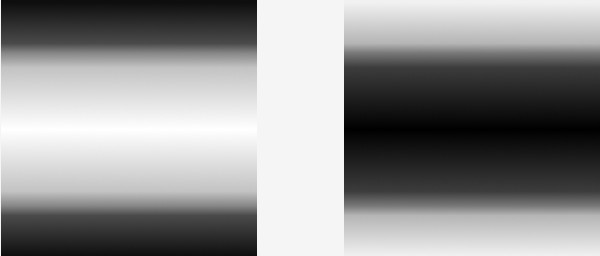
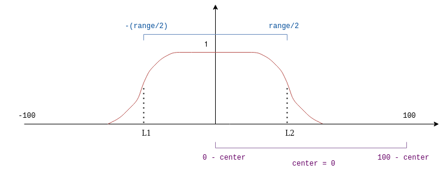
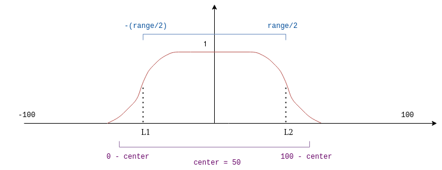
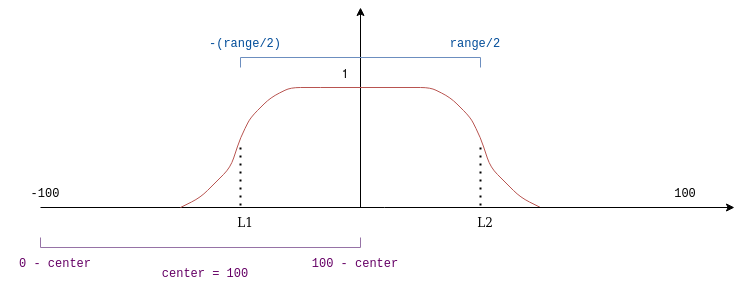

Fotografos profissionais estão sempre buscando por efeitos que destacam as partes interessantes de um cenário, para atingir este objetivo eles utilizam-se de sua maestria da iluminação de cenários junto com algumas lentes avançadas para cameras que os permitem obter o efeito desejado como, por exemplo, o destaque de uma pessoa em primeiro plano, enquanto mantem-se o fundo ao redor dela borrado.

Já que estas cameras necessitam de um processo de engenharia bastante complicado para ser feitas, seus preços são normalmente bastante caros, o que pode manter alguns aspirantes a fotográfos longe da prática. Felizmente, nós podemos simular alguns desses efeitos em um computador utilizando técnicas de processamento de images, o que nos permitem testar diversos efeitos sem precisar comprar uma dessas câmeras.

Um efeito interessante que nós podemos testar é chamado de tilt-shift, que é criado como resultado da inclinação das lentes em relação ao sensor da câmera de forma que apenas uma subseção do cenário ficará em foco. Esse efeito é famoso por fazer com que a figura apareça como uma fotografia de um mundo em miniaturas. Alguns desses efeitos podem ser vistos nas imagens abaixo:


O objetivo desse artigo é tentar simular o este efeito no pós-processamento com OpenCV. Essa simulação talvez não dê todas as funcionalidades que você teria com lentes de câmeras profissionais, mas ainda assim é uma forma interessante de observar o que o processamento de imagens é capaz de fazer.

## Entendendo como simular o efeito

Para obter o efeito tilt-shift nós precisamos notar que a imagem original é borrada em algumas seções e mantida sem processamento em outras. Se você leu o artigo sobre [filtros espaciais](/blog/opencv-spatial-filters) anteriormente, você sabe que podemos borrar uma imagem ao aplicar um filtro suavizante, o que nós dá parte do efeito que queremos.

Após aplicar o filtro, nós temos uma imagem borrada junto com a imagem original não processada. Nós precisamos encontrar uma forma de misturas estas imagens de forma que o efeito seja similar ao do tilt-shift. A mistura de imagens no OpenCV é feita por meio da função [cv::addWeighted()](https://docs.opencv.org/4.4.0/d2/de8/group__core__array.html#gafafb2513349db3bcff51f54ee5592a19), que faz uma adição elemento a elemento entre duas imagens, utilizando um peso especificado para cada. A operação matemática que ela implementa é dada abaixo:

$$
	dst(I) = \alpha \cdot src_{1}(I) + \beta \cdot  src_{2}(I) + \gamma
$$

Onde $dst$ representa a imagem de destino, $src_{1}$ e $src_{2}$ são as imagens de entrada e $\alpha$ e $\beta$ são os coeficientes definidos pelo usuário. Para fazer a mistura das imagens, nós precisamos modifcá-la um pouco para que os coeficientes representem o quão forte será o efeito de cada imagem na saida da operação. Então nós obtemos a seguinte definição:

$$
	dst(I) = \alpha \cdot src_{1}(I) + (1 - \alpha) \cdot src_{2}(I)
$$

Com esta função nos podemos misturar a imagem original com a borrada, mas isto ainda não é o efeito que queremos, já que irá combinar ambas as imagens completamente e nós queremos que apenas certas partes sejam combinadas. Para corrigir isso, nós precisamos variar os coeficientes de forma que em algumas seções a imagem borrada tenha mais efeito e em outras, a imagem original tenha efeito maior. Isto é feito utilizando a seguinte função para caracterizar os coeficientes:

$$
	\alpha(x, l1, l2, d) = \frac{\tanh(\frac{x - l1}{d}) - \tanh(\frac{x - l2}{d})}{2}
$$

Onde $l1$ e $l2$ são os pontos de transição na imagem, onde ela muda entre borrada e não-borrada, e o parâmetro $d$ representa o quão rápido esta transição acontece. Isto pode ser difícil de entender a partir da definição matemática por si só, então vamos olhar o gráfico da função para os parâmetros $l1$ = -20, $l2$ = 30 e $d$ = 6.


Nós podemos interpretar este gráfico ao pensar que nos pontos onde o valor é 0, a imagem resultante será borrada e onde é igual a 1, a imagem de saída não terá nenhum efeito aplicado. Dessa forma, apenas as regiões próximas do topo e parte inferior da imagem serão borradas, o que nos dá um efeito similar ao tilt-shift. Nós também podemos notar que os pontos de inflexão das curvas são dados pelos parâmetros $l1$ e $l2$, nós podemos utilizar isto para manipular qual seção da imagem será borrada.

Agoras nós temos uma forma de simular o tilt-shift: nós borramos a imagem original e combinamos esta imagem borrada com a original utilizando um adição com pesos, onde estes pesos são dados pela função que nós definimos acima. Vamos ver como fazer como fazer isto no OpenCV.

## Colocando em prática

A primeira coisa que precisamos fazer é traduzir a função de caracterização dos coeficientes em uma máscasra que podemos aplicar na imagem. A máscara que queremos criar deve ser similar a essa:



As partes escuras da máscara esquerda são as seções da imagem original em que ela terá menor efeito no resultado ($\alpha$ = 0), a parte clara é onde a imagem original terá maior efeito ($\alpha$ = 1). Nós precisamos de duas máscaras porquê uma será aplicada na imagem original e outra na imagem borrada.

Para criar esta máscara, nós iremos primeiro criar um array de tamanho igual à altura da imagem, preenchido com amostras discretas da função. Isto é feito por meio da seguinta função no C++:

```Cpp
#include <iostream>
#include <cstdio>
#include <cmath>
#include <opencv2/opencv.hpp>
#include <lyra/lyra.hpp>

#define assertm(exp, msg) assert(((void) msg, exp))

// ------ Geração da máscara de blending -------

// Gera dados para uma única linha da máscara de blending dada a função:
//
// ( tanh((x - lb) / decay) - tanh((x - hb) / decay) ) / 2
//
// Esta função será avaliada entre [low_bound] e [high_bound]
// e irá gerar um vetor com exatamente [size] valores.
std::vector<float> blend(int min_range, int max_range, int low_bound, int high_bound, int decay, int size) {
    assertm(min_range < max_range, "blend range is defined incorrectly. min_range >= max_range");
    assertm(low_bound <= high_bound, "boundary range is defined incorrectly. low_bound > high_bound");
    assertm(decay != 0, "decay coefficient is equal to zero");

    std::vector<float> lu_table;
    lu_table.reserve(size);                // Preallocate memory since we already know the final size

    float step = (float) (max_range - min_range) / size;
    for (int i = 0; i < size; ++i) {
        float x = min_range + i * step;
        float result = std::tanh((x - low_bound) / decay) - std::tanh((x - high_bound) / decay);
        lu_table.push_back(result / 2);
    }

    return lu_table;
}
```
<br/>

Está função avalia a função de caracterização de coeficientes para valores entre [*min_range*, *max_range*], amostrando-a em intervalos iguais com periodo definido pela variável *step*. Os valroes resultantes são armazenados em um array e returnados para o invocador da função. A função assertm é usada para fazer algumas asserções simples sobre suas invariantes.

Após executar esta função, nós obtemos um array com os valores desejados, mas isso ainda não é a máscara que queremos. Para completar o processo, precisamos transpor o array e copiá-lo pelas colunas até que tenhamos a mesma largura da imagem. Para fazer isso, precisamos definir outra função:

```Cpp
cv::Mat smooth_blend_mask(
    cv::Size size,
    int min_range,
    int max_range,
    int low_bound, 
    int high_bound, 
    int decay
) {
    cv::Mat mask(size.width, size.height, CV_32FC1);
    auto blend_values = blend(min_range, max_range, low_bound, high_bound, decay, size.height);
    cv::Mat blend_mask_row(1, size.height, CV_32FC1, blend_values.data());

    // Repete a linha com valores de blending para gerar uma máscara
    for (int i = 0; i < size.width; i++) {
        blend_mask_row.copyTo(mask.row(i));
    }

    // Os valores da função foram dispostos horizontalmente
    // mas nós queremos que a máscara seja vertical ao invés de horizontal
    cv::transpose(mask, mask);
    return mask;
}
```
<br/>

Nesse trecho de código, eu copiei o array de dados horizontalmente e tranpus a máscara resultante, o que nós dá o mesmo resultado de transpor o array primeiro e depois copiá-lo pela coluna.

Com a máscara pronta, é possível aplicá-la na imagem e ver o efeito de tilt-shift resultante, mas antes de fazer isto, vamos utilizando as ferramentas de interface de usuário do OpenCV para que possamos manipular o efeito e entender melhor como ele funciona.

Nós iremos definir 3 sliders:

- **center** - O ponto médio onde a máscara será aplicada na imagem.
- **decay** - O quão rápido a transição entre borrado e não-borrado acontece.
- **range** - O quão larga será a seção não-borrada da imagem.

```Cpp
// ------  Gerenciamento de sliders da UI -------

//  Ponto médio da máscara
int center = 0;
int center_slider = 0;
int center_slider_max = 100;

// O quão rápido a transição entre borrado e não borrado
// acontece
int decay = 1;
int decay_slider = 0;
int decay_slider_max = 39;

// Define a seção não borrada da imagem
int range = 0;
int range_slider = 0;
int range_slider_max = 100;

cv::Mat image, blur_mask, blurred_image;
cv::Mat weighted_blur, weighted_image, blended;
cv::Mat imageTop;

char trackbar_name[50];

void do_blending() {
    auto min_range = 0 - center;
    auto max_range = 100 - center;
    auto low_bound = -range / 2;
    auto hi_bound = +range / 2;

    blur_mask = smooth_blend_mask(
        image.size(), 
        min_range,
        max_range,
        low_bound, 
        hi_bound, 
        decay
    );

    cv::Mat bgr_mask;
    // transforma a máscara de um canal em uma imagem de três canais
    cv::cvtColor(blur_mask, bgr_mask, cv::COLOR_GRAY2BGR);
    auto inverse_mask = CV_RGB(1, 1, 1) - bgr_mask;

    cv::multiply(bgr_mask, image, weighted_image);
    cv::multiply(inverse_mask, blurred_image, weighted_blur);
    cv::add(weighted_image, weighted_blur, blended);

    blended.convertTo(blended, CV_8UC3);
    cv::imshow("addweighted", blended);
}

void on_trackbar_center_changed(int, void*) {
    center = center_slider;
    do_blending();
}

void on_trackbar_decay_changed(int, void*) {
    decay = 1 + decay_slider;
    do_blending();
}

void on_trackbar_range_changed(int, void*) {
    range = range_slider;
    do_blending();
}
```
<br/>

A parte mais interessante do trecho acima é a função *do\_blending()*, que inicia com a definição dos intervalos em que o função dos coeficientes será avaliada e a variável de centro, que não representa o centro da máscara, nem o centro da imagem, mas na verdade um mapeamento entre a imagem e a máscara: Quando *center = 0* o centro da função estará no início da imagem, quando *centro = 50* o centro da função está no meio da imagem e quando *center = 100*, o centro da função estará no final da imagem.

Isto é mais simples de ser observado a partir de imagens:

Quando *center = 0* :



Quando *center = 50* :



Quando *center = 100* :



Você pode pensar sobre o eixo vertical da imagem como sendo a linha roxa nas figuras acima.

Por fim, nós podemos unir tudo e observar os resultados.

```Cpp
#include <iostream>
#include <cstdio>
#include <cmath>
#include <opencv2/opencv.hpp>
#include <lyra/lyra.hpp>

#define assertm(exp, msg) assert(((void) msg, exp))

struct Config {
    const std::string image_path;
    const int height;
    const int width;
};

Config parse_cli(int argc, char* argv[]) { 
   /* Obter argumentos da linha de comando */ 
}

/* Definição da função de blending */

/* Definição da função da máscara de blending */

/* sliders e listeners da UI */

const cv::Matx33f filtro_borramento = {
    1./9, 1./9, 1./9,
    1./9, 1./9, 1./9,
    1./9, 1./9, 1./9
};

int main(int argc, char* argv[]) {
    auto config = parse_cli(argc, argv);
    image = cv::imread(config.image_path);

    cv::Size image_size { config.width, config.height };
    cv::resize(image, image, image_size);

    image.convertTo(image, CV_32FC3);
    image.copyTo(blurred_image);
    // Aplicamos o filtro de borramentos multiplas
    // vezes para que o efeito seja mais visível
    for (int i = 0; i < 5; ++i) {
        cv::filter2D(
            blurred_image, 
            blurred_image, 
            blurred_image.depth(), 
            blur_filter
        );
    }

    // Criando os sliders
    cv::namedWindow("addweighted", 1);
    std::sprintf(trackbar_name, "Center x %d", center_slider);
    cv::createTrackbar(trackbar_name, "addweighted",
            &center_slider,
            center_slider_max,
            on_trackbar_center_changed);
    on_trackbar_center_changed(center_slider, nullptr );

    std::sprintf(trackbar_name, "Decay x %d",  decay_slider);
    cv::createTrackbar(trackbar_name, "addweighted",
            &decay_slider,
            decay_slider_max,
            on_trackbar_decay_changed );
    on_trackbar_decay_changed(decay_slider, nullptr );

    std::sprintf(trackbar_name, "Range x %d",  range_slider);
    cv::createTrackbar(trackbar_name, "addweighted",
            &range_slider,
            range_slider_max,
            on_trackbar_range_changed );
    on_trackbar_range_changed(range_slider, nullptr );

    cv::waitKey(0);
    return 0;
}
```
<br/>

*Para obter os argumentos de linha de comando, eu utilizei a biblioteca [lyra](https://github.com/bfgroup/Lyra), mas você qualquer biblioteca de sua preferência.*

Este é o resultado obtido quando executamos o binário [nessa imagem](https://www.flickr.com/photos/romainguy/50386634128/in/dateposted-public/) com os parametros *center = 58*, *decay = 10* e *range = 45*:


Nós podemos ver que o efeito na imagem é bem similar ao do tilt-shift feito por lentes de câmeras profissionais, onde o centro da imagem está em foco e as bordas ficam borradas.


